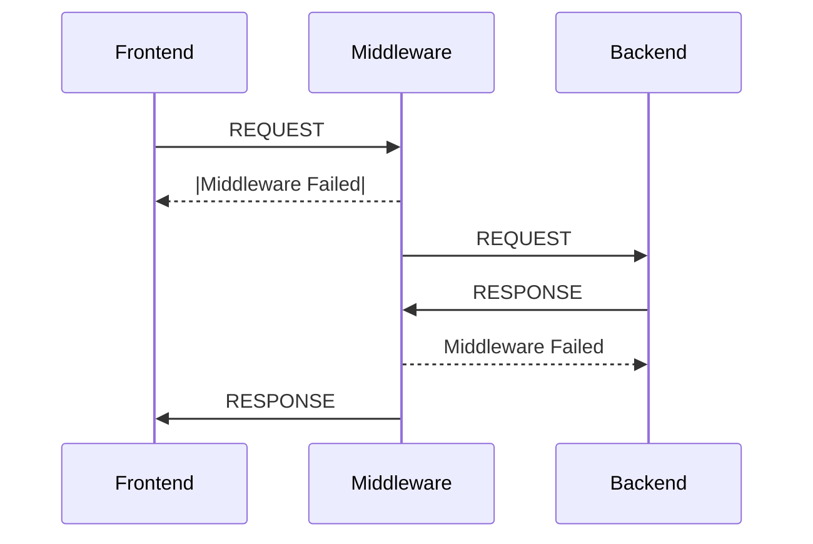

# Settings

Once a Django project is been created, it comes with predefined Directory Structure having the following files with each of its own uses.

    //create a Django project
    django-admin startproject mysite

    //change directory to project
    cd mysite

Now, you are in base project directory named mysite, as we already seen the Structure of Directory.

```bash
.
├── db.sqlite3 <--BaseDIR
├── manage.py
└── mysite
    ├── asgi.py
    ├── __init__.py
    ├── settings.py <--Settings
    ├── urls.py
    └── wsgi.py
```

## Base Package

Base Package is the dirrectory which contains all the neccessary files for django project.

`ie. __init__.py, asgi.py, settings.py, urls.py, wsgi.py`

One of the files is settings.py which holds the neccessary details related to project.

---

## BASE_DIR

Starting with a Import of `Path` module responsible to fetch the root project directory which can be access anywhere.

    from pathlib import Path
    # Build paths inside the project like this: BASE_DIR / 'subdir'.
    BASE_DIR = Path(__file__).resolve().parent.parent

## Secret Key, Allowed Host & Debug

With every django project comes with a 'Secret Key' For Making each django project Unique.
Debug - In Development Error is very obvious to occur. There is no fun in writing a program where we do not face any error. but sometimes tackling errors is very hectic. Django provides an inbuilt Debugger which makes the developer’s life very easy
Allowed Hosts - ALLOWED_HOSTS is a list having addresses of all domains which can run your Django Project. *Required to make Debug False*

    # SECURITY WARNING: keep the secret key used in production secret!
    SECRET_KEY = "django-insecure-)vszb2t21!&z-$ep&-y3ln%y9&_t=d(8v+creo3f0wuab^+ai)"
    # SECURITY WARNING: don't run with debug turned on in production!
    DEBUG = True
    ALLOWED_HOSTS = []

When DEBUG set to True

ALLOWED_HOSTS can be an empty list

    ALLOWED_HOSTS=[ ]

    //Default is
    127.0.0.1 or localhost

When DEBUG set to False
ALLOWED_HOSTS can not be an empty list. We have to give hosts name in list.

    ALLOWED_HOSTS=[“127.0.0.1”, “*.heroku.com”]

*“127.0.0.1” represents Your PC, “\*.heroku.com” represents this application can be run on heroku also.*

## Installed Applications

This includes all the application required for django project *preinstallaed* as well as custom application that we create later also python packages which we are using later for simplification of our development process *ie. django_extensions, schema_graph, etc*

    # Application definition

    INSTALLED_APPS = [
        "django.contrib.admin",
        "django.contrib.auth",
        "django.contrib.contenttypes",
        "django.contrib.sessions",
        "django.contrib.messages",
        "django.contrib.staticfiles",
    ]

    # Custom application

    INSTALLED_APPS = [
        // Some preloaded apps by Django,
        'polls',
    ]

## Middlewares

Middleware is a framework of hooks into Django’s request/response processing. It’s a light, low-level “plugin” system for globally altering Django’s input or output.

Each middleware component is responsible for doing some specific function. For example, Django includes a middleware component, AuthenticationMiddleware, that associates users with requests using sessions.



    MIDDLEWARE = [
        "django.middleware.security.SecurityMiddleware",
        "django.contrib.sessions.middleware.SessionMiddleware",
        "django.middleware.common.CommonMiddleware",
        "django.middleware.csrf.CsrfViewMiddleware",
        "django.contrib.auth.middleware.AuthenticationMiddleware",
        "django.contrib.messages.middleware.MessageMiddleware",
        "django.middleware.clickjacking.XFrameOptionsMiddleware",
    ]

## URLCONF

A URLconf is similar to a table of contents for our Django-powered web site. It's a mapping between URL patterns and the view functions that need to be called for those URLs.

    ROOT_URLCONF = "mysite.urls"

## Templates

Django is among the most recommended full stack web development frameworks at the moment. Django follows Model-Template-View (MTV) architecture. This is something similar to the traditional MVC( Model-View_Controller) architecture, but in Django, views are more like controllers, and MVC’s views are actually the template of Django.

Django templates define the layout and final formatting sent to end users after a view method is finished processing a request. MTV architecture lets Django sperate Python and HTML code which is necessary because at the moment browsers don't understand Python.

    TEMPLATES = [
        {
            "BACKEND": "django.template.backends.django.DjangoTemplates",
            "DIRS": [],
            "APP_DIRS": True,
            "OPTIONS": {
                "context_processors": [
                    "django.template.context_processors.debug",
                    "django.template.context_processors.request",
                    "django.contrib.auth.context_processors.auth",
                    "django.contrib.messages.context_processors.messages",
                ],
            },
        },
    ]

> context_processors: context_processors is a list of dotted Python paths to callables that are used to populate the context when a template is rendered with a request. These callables take a request object as their argument and return a dict of items to be merged into the context.

## Databases

With Every web application requires some system to store user information, Django supports database with MVT (Modal View Template) Process which Binds the concept of modals with Database Templates.

Django officially supports the following databases:

    PostgreSQL
    MariaDB
    MySQL
    Oracle
    SQLite <– By Default

    # Database

    DATABASES = {
        "default": {
            "ENGINE": "django.db.backends.sqlite3",
            "NAME": BASE_DIR / "db.sqlite3",
        }
    }

*but, in large scale projects it is now recommended to use sqlite3 database as primary, the most popular and widely used database with django is postgresql*

    DATABASES = {
        'default': {
            'ENGINE': 'django.db.backends.postgresql',
            'NAME': YOUR_DB_NAME,
            'USER': USERNAME,
            'PASSWORD': PASSWORD_FOR_DB,
            'HOST': 'localhost'  // in Development.
        }
    }

## Password Validators

Django encrypts the password using sha256 encryption system along with password validation for user password using various modules.

    # Password validation
    # https://docs.djangoproject.com/en/5.0/ref/settings/#auth-password-validators

    AUTH_PASSWORD_VALIDATORS = [
        {
            "NAME": "django.contrib.auth.password_validation.UserAttributeSimilarityValidator",
        },
        {
            "NAME": "django.contrib.auth.password_validation.MinimumLengthValidator",
        },
        {
            "NAME": "django.contrib.auth.password_validation.CommonPasswordValidator",
        },
        {
            "NAME": "django.contrib.auth.password_validation.NumericPasswordValidator",
        },
    ]

---

## Other Constants

1. Language Constant

    LANGUAGE_CODE = "en-us"

2. Timezone Constants

    TIME_ZONE = "UTC"

    USE_I18N = True

    USE_TZ = True

3. Static Files: Files which are used in templates ie. application & its url

        # Static files (CSS, JavaScript, Images)
        # https://docs.djangoproject.com/en/5.0/howto/static-files/

        STATIC_URL = "static/"
        STATIC_ROOT= os.path.join(BASE_DIR, 'static')

4. Default primary key field type

        DEFAULT_AUTO_FIELD = "django.db.models.BigAutoField"

5. MEDIA_ROOT

One of the files which is presently not there but it is as important as templates and static files. As static files used to load static data, Media files is responsible to store user information which is stored in databases. the data is dynamic and creation is based on user.

MEDIA_ROOT is an absolute path. This variable is used to retrieve the media files.

    MEDIA_ROOT= os.path.join(BASE_DIR, 'media')

<link href="https://maxcdn.bootstrapcdn.com/bootstrap/3.3.6/css/bootstrap.min.css" rel="stylesheet" />
