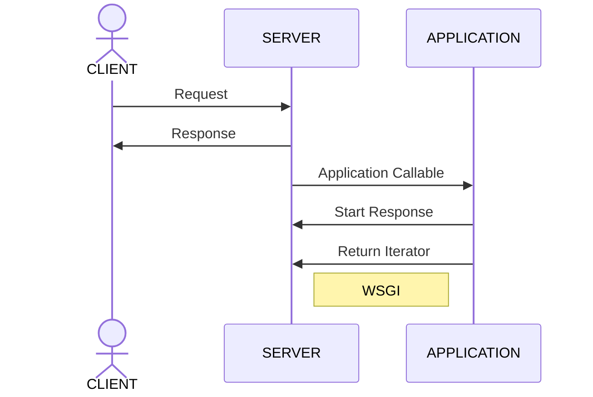

# WSGI File

WSGI is the Web Server Gateway Interface. It is a specification that describes how a web server communicates with web applications, and how web applications can be chained together to process one request.The Python community came up with WSGI as a standard interface that modules and containers could implement. WSGI is now the accepted approach for running Python web applications.

When the WSGI server loads your application, Django must import the settings module — this is where your entire application is defined.

Django uses the DJANGO_SETTINGS_MODULE environment variable to locate the appropriate settings module. It should contain the dotted path to the settings module. According to your preference or according to the needs of your architecture you can use a different value for development and production.

WSGI servers get the callable application path from their configuration. Django’s built-in server, namely the runserver command, reads it from the WSGI_APPLICATION parameter.

Sample Content of File:

    """
    WSGI config for mysite project.

    It exposes the WSGI callable as a module-level variable named ``application``.
    """

    import os

    from django.core.wsgi import get_wsgi_application

    os.environ.setdefault("DJANGO_SETTINGS_MODULE", "mysite.settings")

    application = get_wsgi_application()

The wsgi file is automatically generated by Django when creating your project. You need to set things up correctly based on your environment to run your app properly.

<link href="https://maxcdn.bootstrapcdn.com/bootstrap/3.3.6/css/bootstrap.min.css" rel="stylesheet" />
