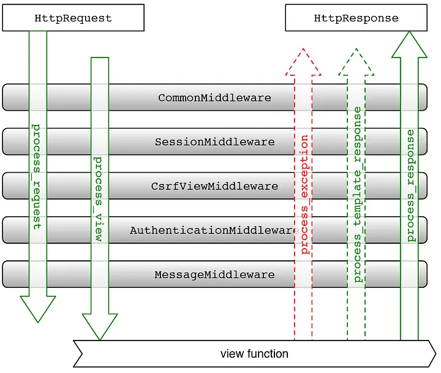
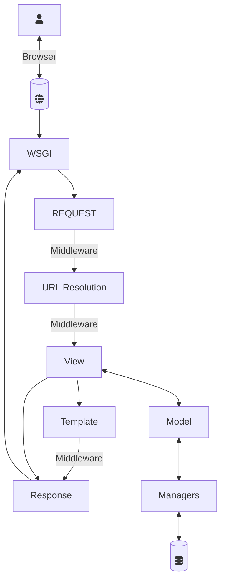

# Django: Request/Response Cycle

Lets, Understand the Django request response cycle.

It consists of Various Processes,

## WSGI

As we know a Web server is a program that uses HTTP (Hypertext Transfer Protocol) to serve the files that form Web pages to users, in response to their requests, which are forwarded by their computers’ HTTPclients.

WSGI is a tool created to solve a basic problem: connecting a web server to a web framework. WSGI has two sides: the ‘server’ side and the ‘application’ side. To handle a WSGI response, the server executes the application and provides a callback function to the application side. The application processes the request and returns the response to the server using the provided callback. Essentially, the WSGI handler acts as the gatekeeper between your web server (Apache, NGINX, etc) and your Django project.

---

## Request - Response Flow

When the user makes a request of your application, a WSGI handler is instantiated, which

1. imports your settings.py file and Django’s exception classes.
2. loads all the middleware classes it finds in the MIDDLEWARE_CLASSES or MIDDLEWARES(depending on Django version) tuple located in settings.py
3. builds four lists of methods which handle processing of request, view, response, and exception.
4. loops through the request methods, running them in order
resolves the requested URL
5. loops through each of the view processing methods
calls the view function (usually rendering a template)
processes any exception methods
6. loops through each of the response methods, (from the inside out, reverse order from request middlewares)
7. finally builds a return value and calls the callback function to the web server

---

## Layers of Django Application

1. Request Middlewares
2. URL Router(URL Dispatcher)
3. Views
4. Context Processors
5. Template Renderers
6. Response Middlewares

Django Request-Response Cycle
At least one of the methods listed below must be included in Django middlewares:

1. process_request
2. process_response
3. process_view
4. process_exception

---

## Process Request

Some middlewares in settings.py will lack process_request methods. It’s not a big deal; such are just bypassed throughout this stage.process_request should either return None (as in this example) or a HttpResponse object. In the former situation, the WSGI Handler will continue to execute the process_request methods; in the latter, the process will be “short-circuited” and the process will begin the process_response cycle.

## URLCONF

After each process request method is triggered, we now have a request object that is transferred to the view. Django needs to solve the URL and determine the call function view. Settings.py will contain a key named ROOT URLCONF that displays a root urls.py file that you shall include in each application's urls.py file.

## process_view

After reading the URLConf and finding the correct view to match some pattern in the URLConf list, the view is called The Django middleware process_view method is declared like this: process_view(request, view_function, view_args, view_kwargs) The process_view function, like the process_request method, must return either None or a HttpResponse object (or raise an exception).

## process_exception

The Handler will loop through its list of process_exception methods if the view function raises an exception. From the final middleware defined in settings.py to the first, these methods are called in reverse order.

## process_response

Response middleware processes the request and adds or changes the header information before returning it to the customer (Browser). After that, the browser will analyze the information and present it to the user.

<link href="https://maxcdn.bootstrapcdn.com/bootstrap/3.3.6/css/bootstrap.min.css" rel="stylesheet" />
