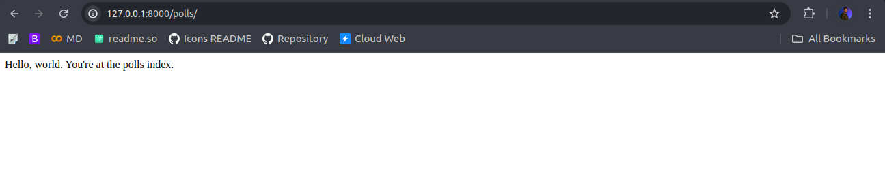
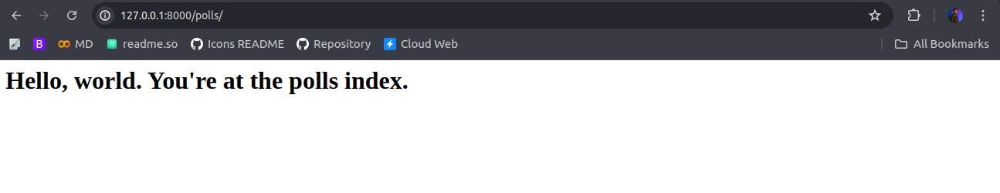

# Polls Application

As we are Already seen each file in Django Project root Package, now we are ready to start our polling application.

Starting with server,

    python manage.py runserver

Here comes the default page rocket, Now lets start with a `Hello World Page`

## Create a New Polls Appication

We are already familiar with custom apps, custom apps are used to create different components in a large scale django project.

Each app have its own models which we create later.

    # Create a New App
    python manage.py startapp polls

*You can use django-admin as well as manage.py*

```bash
.
├── db.sqlite3
├── manage.py
├── mysite
│   ├── __init__.py
│   ├── asgi.py
│   ├── settings.py
│   ├── urls.py
│   └── wsgi.py
└── polls
    ├── admin.py
    ├── apps.py
    ├── __init__.py
    ├── migrations
    │   └── __init__.py
    ├── models.py
    ├── tests.py
    └── views.py
```

## Write First View

Let’s write the first view. Open the file polls/views.py and put the following Python code in it:

    from django.http import HttpResponse

    def index(request):
        return HttpResponse("Hello, world. You're at the polls index.")

## Map Url with View

Now its time to map the same url with corresponsing view, for this Create a new url file in polls application.

> Just Copy with base package url file into polls

    from django.urls import path
    from . import views
    urlpatterns = [
        path("", views.index, name="index"),
    ]

> Now polls app directory looks like this

```bash
polls/
    __init__.py
    admin.py
    apps.py
    migrations/
        __init__.py
    models.py
    tests.py
    urls.py
    views.py
```

## Config the polls url with base URL Config

Open Base Package urls `mysite/urls.py' and add polls urls.

    from django.contrib import admin
    from django.urls import include, path

    urlpatterns = [
        path("polls/", include("polls.urls")),
        path("admin/", admin.site.urls),
    ]

The include() function allows referencing other URLconfs. Whenever Django encounters include(), it chops off whatever part of the URL matched up to that point and sends the remaining string to the included URLconf for further processing.

## Runserver Again

    python manage.py runserver



> Don't Forget to change the address to `/polls`

## Behind the Scenes

Now, how it is done? So, when the url hits the address bar it simply creates a request which after passing thorugh middleware goto URL_CONF which targets the corresponding view.

In the views we accept request and return HttpResponse, in this we can directly send html content as response.

Now, this response after again passing through middlewares, Serve as Response to Client. And in response we have html content so here is out html content.

    <html>
        <head>
        </head>
        <body>
            Hello, world. You're at the polls index.
        </body>
    </html>

Lets Try with a H1 Tag,



    <html>

    <head></head>

    <body>
        <h1>Hello, world. You're at the polls index.</h1>
    </body>

    </html>

<link href="https://maxcdn.bootstrapcdn.com/bootstrap/3.3.6/css/bootstrap.min.css" rel="stylesheet" />
