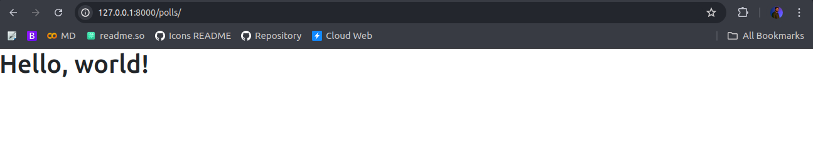

# Load HTML

Now we seen how can we setup Request <--> Response.

And successfully load our HTML Content. But! the content we are loading is short, what if? we have large HTML content lets say 100-200 line of HTML or may be more.

Here we require to send a whole HTML content as Response rather than HttpResponse.

Here comes `render` method. This helps to send the whole HTML content as Response.

But, we need to setup our templates.

***Django templates are the HTML files that define the structure and content of your web application. They act as the visual layer of your application, allowing you to create web pages with dynamic elements. These templates are typically used with Django views and models to build complete web applications.***

    // In the Project Basedir Create templates folder
    mkdir templates

*remember the folder name is case sensitive*

- Our New Tree

```bash
.
├── db.sqlite3
├── manage.py
├── mysite
│   ├── asgi.py
│   ├── __init__.py
│   ├── __pycache__
│   │   ├── __init__.cpython-311.pyc
│   │   ├── settings.cpython-311.pyc
│   │   ├── urls.cpython-311.pyc
│   │   └── wsgi.cpython-311.pyc
│   ├── settings.py
│   ├── urls.py
│   └── wsgi.py
├── polls
│   ├── *Files
└── templates
```

Now Create a HTML File in this templates directory

    ./templates/index.html

Write some HTML Content in this File - Refer HTML, CSS & Bootstrap Docs

| HTML | [link](https://github.com/mohit-trootech/HTML-Documentation) |
|------|-----|
| CSS  | [link](https://github.com/mohit-trootech/CSS-Documentation) |
| Bootstrap | [link](https://github.com/mohit-trootech/Bootstrap-Documentation) |

---

## Update  Setting.py Templates DIRS Path

Now, Lets update templates path in Settings.py file.

1. Open settings.py file and Search for Templates Varable.

        TEMPLATES = [
            {
                "BACKEND": "django.template.backends.django.DjangoTemplates",
                "DIRS": [],
                "APP_DIRS": True,
                "OPTIONS": {
                    "context_processors": [
                        "django.template.context_processors.debug",
                        "django.template.context_processors.request",
                        "django.contrib.auth.context_processors.auth",
                        "django.contrib.messages.context_processors.messages",
                    ],
                },
            },
        ]

2. Update `"DIRS": []` Path

    "DIRS": [BASE_DIR, "templates"],

*You can use os module also preffered option*

    import os //at the top
    "DIRS": [os.path.join(BASE_DIR, "templates")],

3. Update Views

Now we are ready to update our views file. Open views and again use the same view and this time we return response using render.

*render - Combines a given template with a given context dictionary and returns an HttpResponse object with that rendered text.*

    def index(request):
        return render(request, "index.html")



    <body>
        <h1>Hello, world!</h1>
    </body>

*used bootstrap starter Template Html*

<link href="https://maxcdn.bootstrapcdn.com/bootstrap/3.3.6/css/bootstrap.min.css" rel="stylesheet" />
