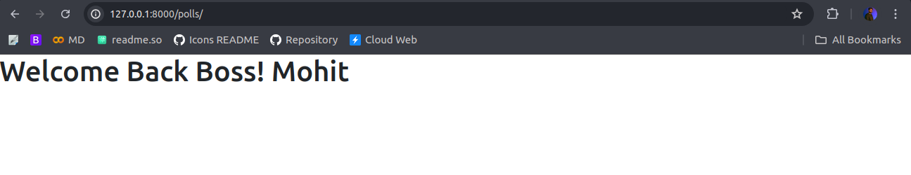

# Template Arguments

Now, We are using Django to create dynamic sites, Means we can send the dynamic HTML Content based on User.

We Create same Template, but it will show different for different user. Let's understand with a Example.

Everone uses Linkedin, When we go to our Profile the data we see there is our data. So these must be something that is responsible for for Dynamic Data, and here now we are talking about this.

Remember about render from last module - used to pass HTML as response. it takes multiple argument, lets understand each one-by-one.

## render()

    render(request, template_name, context=None, content_type=None, status=None, using=None)

Combines a given template with a given context dictionary and returns an HttpResponse object with that rendered text.

Django does not provide a shortcut function which returns a TemplateResponse because the constructor of TemplateResponse offers the same level of convenience as render().

<table class="table table-hover text-center float-center">
    <thead>
        <tr>
            <th>Argument</th>
            <td>Description</td>
        </tr>
    </thead>
    <tbody>
        <tr>
            <th colspan="2">Required Arguments</th>
        </tr>
        <tr>
            <td>request</td>
            <td>The request object used to generate this response.</td>
        </tr>
        <tr>
            <td>template_name</td>
            <td>The full name of a template to use or sequence of template names. If a sequence is given, the first
                template that exists will be used.</td>
        </tr>
        <tr>
            <td colspan="2">Optional Arguments</td>
        </tr>
        <tr>
            <td>context</td>
            <td>A dictionary of values to add to the template context. By default, this is an empty dictionary. If a
                value in the dictionary is callable, the view will call it just before rendering the template.</td>
        </tr>
        <tr>
            <td>content_type</td>
            <td>The MIME type to use for the resulting document. Defaults to 'text/html'.</td>
        </tr>
        <tr>
            <td>status</td>
            <td>The status code for the response. Defaults to 200.</td>
        </tr>
        <tr>
            <td>using</td>
            <td>The NAME of a template engine to use for loading the template.</td>
        </tr>
    </tbody>
</table>

    def my_view(request):
        # View code here...
        return render(
            request,
            "myapp/index.html",
            {
                "foo": "bar",
            },
            content_type="application/xhtml+xml",
        )

Equivalent to Write in HttpResponse

    def my_view(request):
        # View code here...
        t = loader.get_template("myapp/index.html")
        c = {"foo": "bar"}
        return HttpResponse(t.render(c, request), content_type="application/xhtml+xml")

## Update Our HTML

Data Arguments we Pass in HTML are in Dictionary means key and value pairs, the key are used in HTML Later on.

1. Update Views

    def index(request):
        args = {"username": "Mohit"}
        return render(request, "index.html", args)

Equivalent to Write

    def index(request):
        return render(request, "index.html", {"username": "Mohit"})

2. HTML Update

Now Update HTML Based on Key and Where to Use Key

    <body>
        <h1>Welcome Back Boss! {{username}}</h1>
    </body>

*Multiple Arguments can be Passed to HTML*

***Next we are going to talk about how to load images, scripts, stylesheets using Django Render***

<link href="https://maxcdn.bootstrapcdn.com/bootstrap/3.3.6/css/bootstrap.min.css" rel="stylesheet" />
