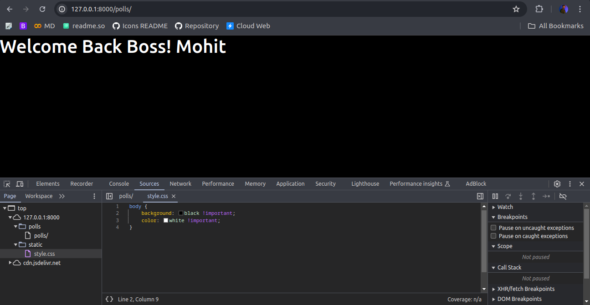

# How to manage static files (e.g. images, JavaScript, CSS)

Websites generally need to serve additional files such as images, JavaScript, or CSS. In Django, we refer to these files as “static files”. Django provides django.contrib.staticfiles to help you manage them.

Lets Understand how you will work with this,

## 1. Create Static Directory

First of all, we require a Static Files directory where we serve all our static files.

You can Locate Static files in `static` named folder in each directory. But it is not preferred way in development of large applications.

- *You May create a Directory in templates folder which is standard way to locate your static files when they are not application specific*
- *Application static files are served in respective app directory just create a directory named `static/` there*

> lets create a static files directory in root directory

```bash
.
├── db.sqlite3
├── manage.py
├── mysite
│   ├── *Files
├── polls
│   ├── *Files
└── templates
    ├── index.html
    └── static
        ├── images
        ├── scripts.js
        └── style.css
```

*file directory name is case sensitive*
2. Configure Path of static Files

Open Settings.py file and seach for `STATIC_URL` Variable

    // Static files (CSS, JavaScript, Images)
    STATIC_URL = "static/"

Now Create a New Variable Named = `STAICFILES_DIRS`

STATIC_URL = "static/"
STATICFILES_DIRS = (os.path.join(BASE_DIR, "templates/static"))

> Final Directory Structure & Must be a Tuple or List

Remeber When Your static path is root then dont add `templates/`.

3. Lets Update CSS File for Current HTML

    body {
        background-color: black;
        color: white;
    }

4. Update HTML File and Load Stylesheel

Here comes the Part How to Load Files, Lets try Standard Way.

    <head>
    <meta charset="utf-8">
    <meta name="viewport" content="width=device-width, initial-scale=1">
    <title>Bootstrap demo</title>
    <link rel="stylesheet" href="./static/style.css">
    <link href="https://cdn.jsdelivr.net/npm/bootstrap@5.3.3/dist/css/bootstrap.min.css" rel="stylesheet" integrity="sha384-QWTKZyjpPEjISv5WaRU9OFeRpok6YctnYmDr5pNlyT2bRjXh0JMhjY6hW+ALEwIH" crossorigin="anonymous">
    </head>

> As we Updated Head Tag and Added StyleSheet Still we are not getting data.

We are required to Use jinja Format to add static files dynamically.*later we talk about jinja format, how to write conditions and loops in jinja formats*


> Before

#### Add load static template before doctype tag

    
    <!doctype html>
    <link rel="stylesheet" href="">

> This is how we need to add stylesjeets in HTML **Remember About Quotes formats & escape sequences**



<link href="https://maxcdn.bootstrapcdn.com/bootstrap/3.3.6/css/bootstrap.min.css" rel="stylesheet" />
