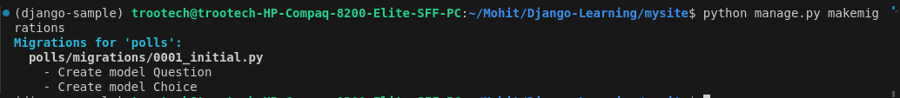
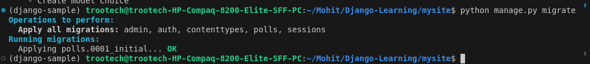

# Creating models

Now we’ll define your models – essentially, your database layout, with additional metadata.

> ## Models
>
> A model is the single, definitive source of information about your data. It contains the essential fields and behaviors of the data you’re storing. Django follows the DRY Principle. The goal is to define your data model in one place and automatically derive things from it.

In our poll app, we’ll create two models: ***Question and Choice***.

A Question has a question and a publication date. A Choice has two fields: the text of the choice and a vote tally. Each Choice is associated with a Question.

These concepts are represented by Python classes. Edit the `polls/models.py` file so it looks like this:

    from django.db import models

    class Question(models.Model):
        question_text = models.CharField(max_length=200)
        pub_date = models.DateTimeField("date published")

    class Choice(models.Model):
        question = models.ForeignKey(Question, on_delete=models.CASCADE)
        choice_text = models.CharField(max_length=200)
        votes = models.IntegerField(default=0)

## Activate Model

To include the app in our project, we need to add a reference to its configuration class in the INSTALLED_APPS setting.

The PollsConfig class is in the polls/apps.py file, so its dotted path is 'polls.apps.PollsConfig'. Edit the mysite/settings.py file and add that dotted path to the INSTALLED_APPS setting. It’ll look like this:

    INSTALLED_APPS = [
        "polls.apps.PollsConfig",
        "django.contrib.admin",
        "django.contrib.auth",
        "django.contrib.contenttypes",
        "django.contrib.sessions",
        "django.contrib.messages",
        "django.contrib.staticfiles",
    ]

## Now Django knows to include the polls app. Let’s run another command

    python manage.py makemigrations

    python manage.py migrate

## SQLMIGRATE

If you know about databases, you can also able to see the sql which database use `sqlmigrate` command to view the sql linked to migrations files.

    python manage.py sqlmigrate appname migration_name

Output:

    (django-sample) trootech@trootech-HP-Compaq-8200-Elite-SFF-PC:~/Mohit/Django-Learning/mysite$ python manage.py sqlmigrate polls 0001
    BEGIN
    --

    -- Create model Question
    --

    CREATE TABLE "polls_question" ("id" bigint NOT NULL PRIMARY KEY GENERATED BY DEFAULT AS IDENTITY, "question_text" varchar(200) NOT NULL, "pub_date" timestamp with time zone NOT NULL)
    --

    -- Create model Choice
    --

    CREATE TABLE "polls_choice" ("id" bigint NOT NULL PRIMARY KEY GENERATED BY DEFAULT AS IDENTITY, "choice_text" varchar(200) NOT NULL, "votes" integer NOT NULL, "question_id" bigint NOT NULL);
    ALTER TABLE "polls_choice" ADD CONSTRAINT "polls_choice_question_id_c5b4b260_fk_polls_question_id" FOREIGN KEY ("question_id") REFERENCES "polls_question" ("id") DEFERRABLE INITIALLY DEFERRED;
    CREATE INDEX "polls_choice_question_id_c5b4b260" ON "polls_choice" ("question_id");
    COMMIT;

<link href="https://maxcdn.bootstrapcdn.com/bootstrap/3.3.6/css/bootstrap.min.css" rel="stylesheet" />
