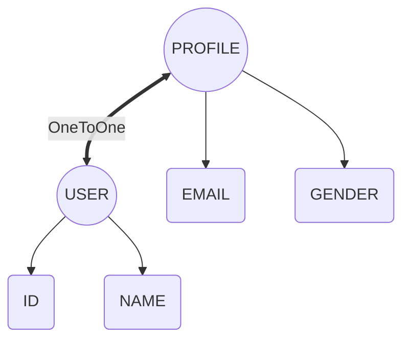
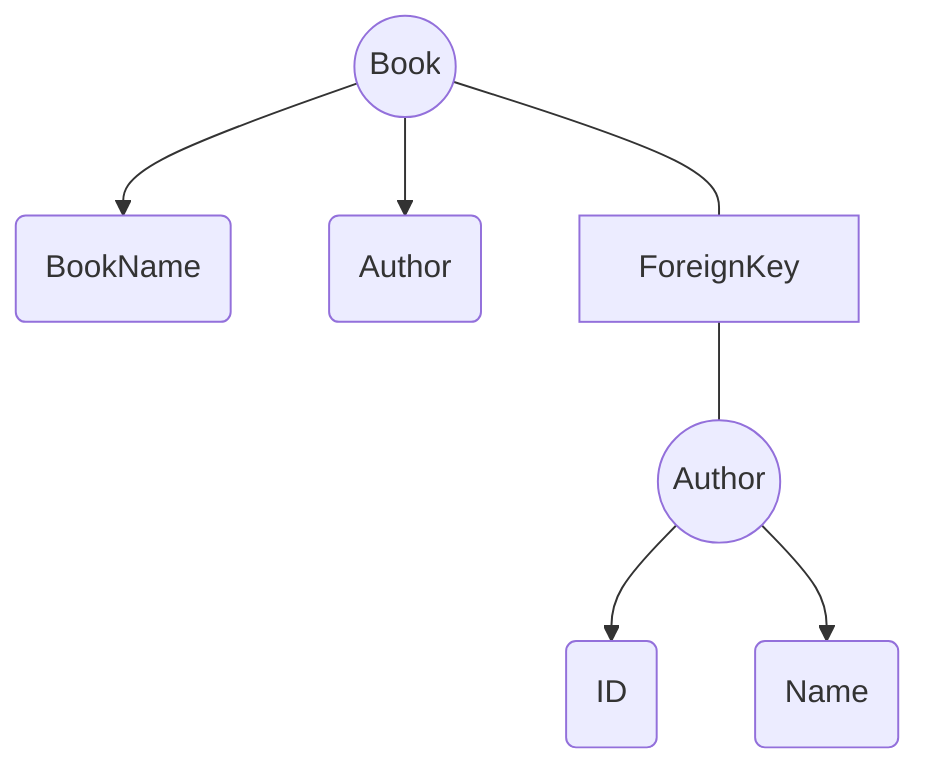
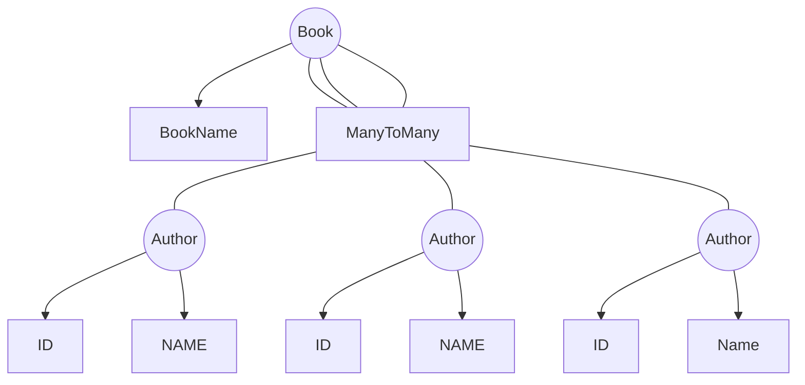

<link href="https://maxcdn.bootstrapcdn.com/bootstrap/3.3.6/css/bootstrap.min.css" rel="stylesheet" />

# Relationships Between Django Models

Websites must be able to store and retrieve data from databases. Django makes provisions for this. By default, Django operates a Relational Database Management System.
Each model in a Django application represents a database table. This means that you can define the kind of relationship you want between the different models in your Django application.
Each model in a Django application represents a database table. This means that you can define the kind of relationship you want between the different models in your Django application.

1. One to One Relationship
2. One to Many Relationship (Foreign Key)
3. Many to Many Relationship

## One-to-One

A one-to-one relationship means that a record in one table relates to a single record in another table

An instance of this is if you have a Django model that defines users. This model can then have a one-to-one relationship with another Django model, which defines users' profiles. In this scenario, a user can have only one profile and a profile can be associated with only one user.

models.py Sample File Code,

    ## models.py

    from django.db import models

    class User(models.Model):
        name = models.CharField(max_length=50)

    class Profile(models.Model):
        user = models.OneToOneField(
            User,
            on_delete=models.PROTECT,
            primary_key=True,
        )
        language = models.CharField(max_length=50)
        email = models.EmailField(max_length=70,blank=True,unique=True)

Let's see what's going on in the above code:

1. Import the module `models`
2. Create a Class `User` and inherit `models.Model` to implement class as a model.
3. Create model attributes `name` using `models.Field` which acts as columns of database.
4. Create another model named `Profile`
5. create a attribute user with `models.OneToOneField` and target another model here.
6. Now the Models have One to One Relationship

---

## Many-to-one Relationship - ForeignKey

In a many-to-one relationship, a record in one table relates to multiple records in another table. Some resources refer to a many-to-one relationship as a one-to-many relationship. These two mean the same thing.

An example of a one to many relationship is the relationship between an author and their published books. While an author can have more than one book to their name, it's less common to find a book with more than one author. You can see this kind of relationship as a parent-child relationship.

The following diagram illustrates a one-to-many relationship:

A diagram showing a one-to-many relationship between an Author model and a Book model.
Django provides you with ForeignKey, which helps define a many-to-one relationship between two different models.

The following code shows you how you can define a many-to-one relationship in Django. Go to your `<app>/models.py` and write the following code:

    from django.db import models

    class Author(models.Model):
        name = models.CharField(max_length=50, blank=False, unique=True)

        def __str__(self):
            return str(self.name)

    class Book(models.Model):
        author = models.ForeignKey(
            Author,
            on_delete=models.PROTECT,
            blank=False
        )

        title = models.CharField(max_length=100)

        def __str__(self):
        return self.title

This code is similar to the code in the first example. However, the ForeignKey keyword is what you use to define a many-to-one relationship between two Django models. In this case, the current model will have a many-to-one relationship with the Author model.

---

## Many-to-Many Relationship

In a many-to-many relationship, multiple records in one table relate to many records in another table. For instance, you may have a collection model in your application, in which one collection has many books within it. In the same vein, a book may belong to several collections.

The following diagram illustrates a many-to-many relationship:

Django provides you with a ManyToManyField which helps define a many-to-many relationship between two different models.

The following code shows you how you can define a many-to-many relationship in Django. Go to your `<app>/models`.py and enter the write the following code:

    from django.db import models

    class Collection(models.Model):
    name = models.CharField(max_length=50)

    def __str__(self):
            return str(self.name)

    class Book(models.Model):
    collection = models.ManyToManyField(Collection)

    title = models.CharField(max_length=100)

    def __str__(self):
            return str(self.title)
In this code sample, the ManyToManyField keyword in line 10 is what you use to define a many-to-many relationship between the Collection and Book models.
