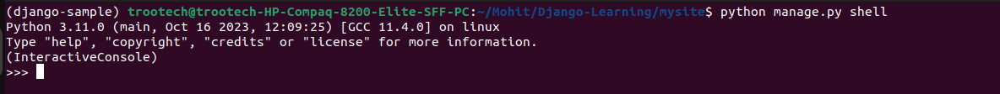

# Playing with the API¶

Now, let’s hop into the interactive Python shell and play around with the free API Django gives you. To invoke the Python shell, use this command:

    python manage.py shell

We’re using this instead of simply typing `“python”`, because manage.py sets the `DJANGO_SETTINGS_MODULE` environment variable, which gives Django the Python import path to your mysite/settings.py file.

## ***Try These Commands***

    >>> from polls.models import Choice, Question  # Import the model classes we just wrote.

    # No questions are in the system yet
    >>>
    >>> Question.objects.all()
    <QuerySet []>

    # Create a new Question

    # Support for time zones is enabled in the default settings file, so

    # Django expects a datetime with tzinfo for pub_date. Use timezone.now()

    # instead of datetime.datetime.now() and it will do the right thing
    >>>
    >>> from django.utils import timezone
    >>> q = Question(question_text="What's new?", pub_date=timezone.now())

    # Save the object into the database. You have to call save() explicitly
    >>>
    >>> q.save()

    # Now it has an ID
    >>>
    >>> q.id
    1

    # Access model field values via Python attributes
    >>>
    >>> q.question_text
    "What's new?"
    >>> q.pub_date
    datetime.datetime(2012, 2, 26, 13, 0, 0, 775217, tzinfo=datetime.timezone.utc)

    # Change values by changing the attributes, then calling save()
    >>>
    >>> q.question_text = "What's up?"
    >>> q.save()

    # objects.all() displays all the questions in the database
    >>>
    >>> Question.objects.all()
    <QuerySet [<Question: Question object (1)>]>

Wait a minute. `<Question: Question object (1)>` isn’t a helpful representation of this object. Let’s fix that by editing the Question model (in the polls/models.py file) and adding a `**str**()` method to both Question and Choice:

    from django.db import models

    class Question(models.Model):
        # ...
        def **str**(self):
            return self.question_text

    class Choice(models.Model):
        # ...
        def **str**(self):
            return self.choice_text

It’s important to add `**str**()` methods to your models, not only for your own convenience when dealing with the interactive prompt, but also because objects’ representations are used throughout Django’s automatically-generated admin.

Let’s also add a custom method to this model:

    import datetime

    from django.db import models
    from django.utils import timezone

    class Question(models.Model):
        # ...
        def was_published_recently(self):
            return self.pub_date >= timezone.now() - datetime.timedelta(days=1)

Note the addition of import datetime and from django.utils import timezone, to reference Python’s standard datetime module and Django’s time-zone-related utilities in django.utils.timezone, respectively.

    >>> python manage.py shell

    >>> from polls.models import Choice, Question

    # Make sure our **str**() addition worked
    >>>
    >>> Question.objects.all()
    <QuerySet [<Question: What's up?>]>

    # Django provides a rich database lookup API that's entirely driven by

    # keyword arguments
    >>>
    >>> Question.objects.filter(id=1)
    <QuerySet [<Question: What's up?>]>
    >>> Question.objects.filter(question_text__startswith="What")
    <QuerySet [<Question: What's up?>]>

    # Get the question that was published this year
    >>>
    >>> from django.utils import timezone
    >>> current_year = timezone.now().year
    >>> Question.objects.get(pub_date__year=current_year)
    <Question: What's up?>

    # Request an ID that doesn't exist, this will raise an exception
    >>>
    >>> Question.objects.get(id=2)
    Traceback (most recent call last):
        ...
    DoesNotExist: Question matching query does not exist.

    # Lookup by a primary key is the most common case, so Django provides a

    # shortcut for primary-key exact lookups

    # The following is identical to Question.objects.get(id=1)
    >>>
    >>> Question.objects.get(pk=1)
    <Question: What's up?>

    # Make sure our custom method worked
    >>>
    >>> q = Question.objects.get(pk=1)
    >>> q.was_published_recently()
    True

    # Give the Question a couple of Choices. The create call constructs a new

    # Choice object, does the INSERT statement, adds the choice to the set

    # of available choices and returns the new Choice object. Django creates

    # a set (defined as "choice_set") to hold the "other side" of a ForeignKey

    # relation (e.g. a question's choice) which can be accessed via the API
    >>>
    >>> q = Question.objects.get(pk=1)

    # Display any choices from the related object set -- none so far
    >>>
    >>> q.choice_set.all()
    <QuerySet []>

    # Create three choices
    >>>
    >>> q.choice_set.create(choice_text="Not much", votes=0)
    <Choice: Not much>
    >>> q.choice_set.create(choice_text="The sky", votes=0)
    <Choice: The sky>
    >>> c = q.choice_set.create(choice_text="Just hacking again", votes=0)

    # Choice objects have API access to their related Question objects
    >>>
    >>> c.question
    <Question: What's up?>

    # And vice versa: Question objects get access to Choice objects
    >>>
    >>> q.choice_set.all()
    <QuerySet [<Choice: Not much>, <Choice: The sky>, <Choice: Just hacking again>]>
    >>> q.choice_set.count()
    3

    # The API automatically follows relationships as far as you need

    # Use double underscores to separate relationships

    # This works as many levels deep as you want; there's no limit

    # Find all Choices for any question whose pub_date is in this year

    # (reusing the 'current_year' variable we created above)
    >>>
    >>> Choice.objects.filter(question__pub_date__year=current_year)
    <QuerySet [<Choice: Not much>, <Choice: The sky>, <Choice: Just hacking again>]>

    # Let's delete one of the choices. Use delete() for that
    >>>
    >>> c = q.choice_set.filter(choice_text__startswith="Just hacking")
    >>> c.delete()

<link href="https://maxcdn.bootstrapcdn.com/bootstrap/3.3.6/css/bootstrap.min.css" rel="stylesheet" />
