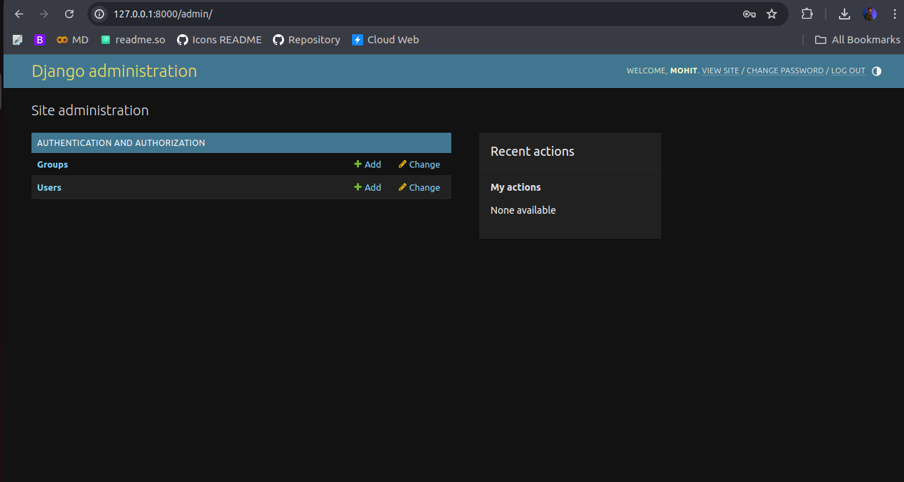
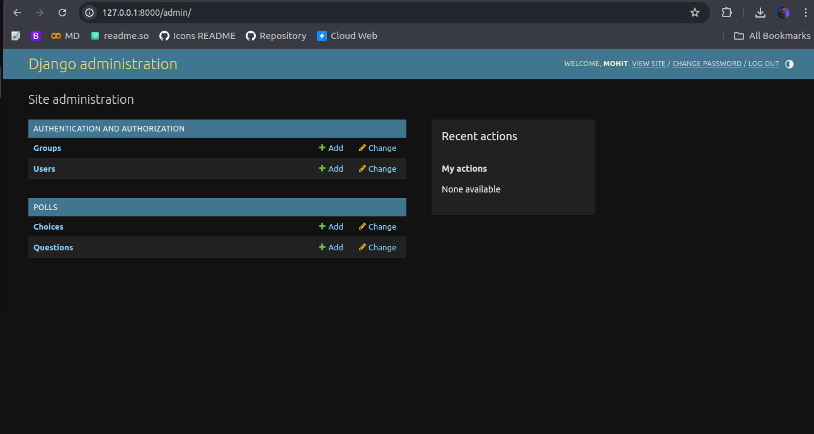
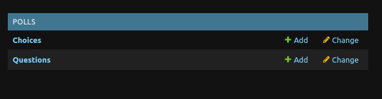
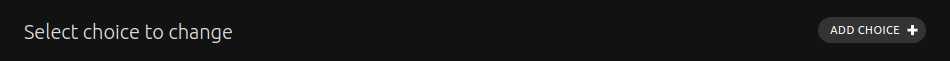
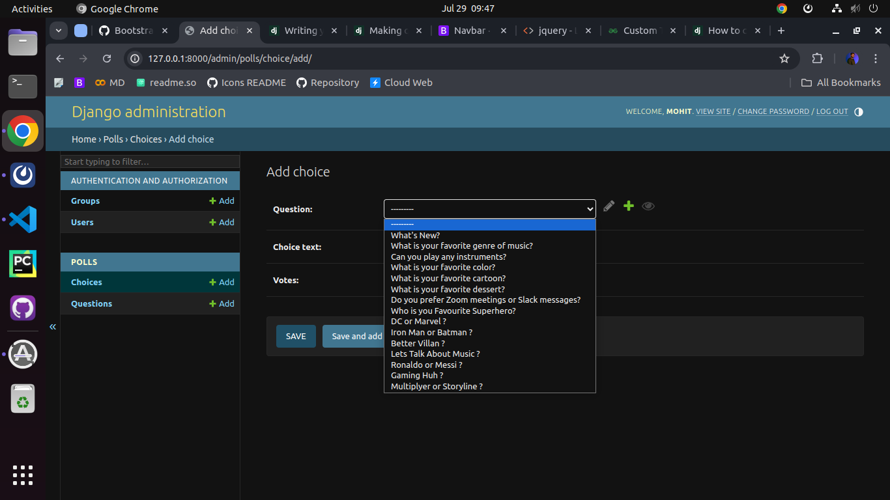
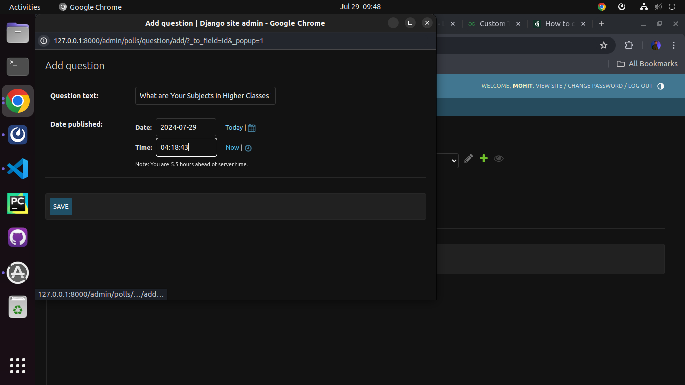
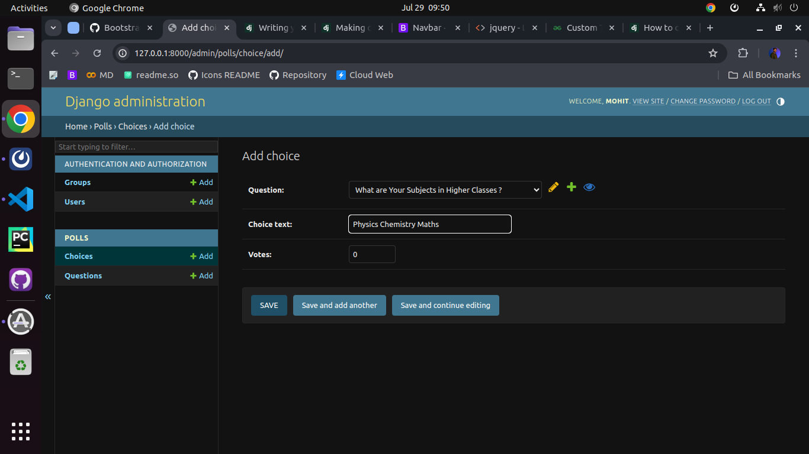
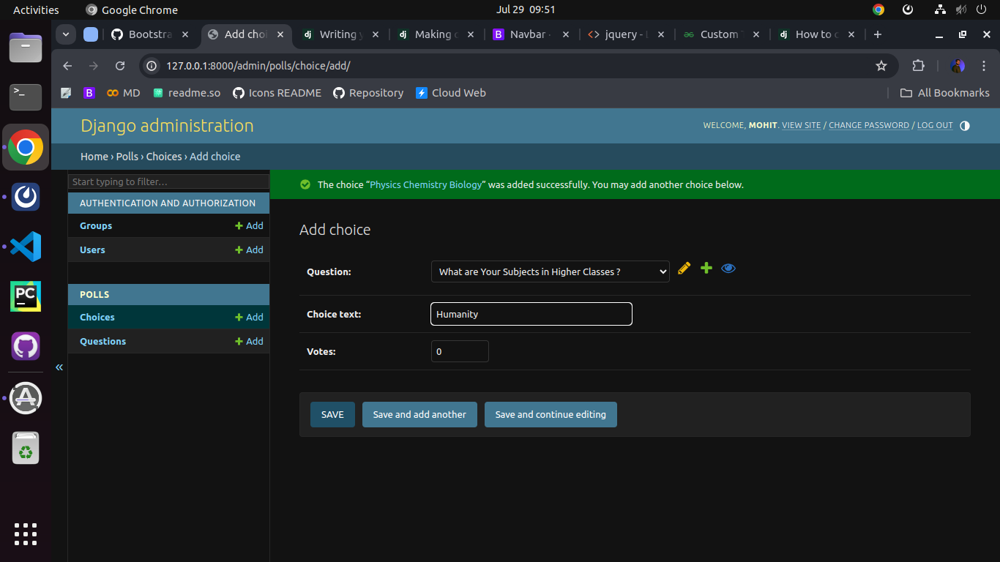

# Django Admin

Generating admin sites for your staff or clients to add, change, and delete content is tedious work that doesn’t require much creativity. For that reason, Django entirely automates creation of admin interfaces for models.

Django was written in a newsroom environment, with a very clear separation between “content publishers” and the “public” site. Site managers use the system to add news stories, events, sports scores, etc., and that content is displayed on the public site. Django solves the problem of creating a unified interface for site administrators to edit content.

The admin isn’t intended to be used by site visitors. It’s for site managers.

## Creating an admin user

First we’ll need to create a user who can login to the admin site. Run the following command:

    python manage.py createsuperuser
Enter your desired username and press enter.

    Username: admin
You will then be prompted for your desired email address:

    Email address: <admin@example.com>
The final step is to enter your password. You will be asked to enter your password twice, the second time as a confirmation of the first.

    Password: **********
    Password (again): *********
Superuser created successfully.

## Start the development server

The Django admin site is activated by default. Let’s start the development server and explore it.

If the server is not running start it like so:

    python manage.py runserver
Now, open a web browser and go to “/admin/” on your local domain – e.g., `http://127.0.0.1:8000/admin/`. You should see the admin’s login screen:

#### Django admin login screen

Since translation is turned on by default, if you set LANGUAGE_CODE, the login screen will be displayed in the given language (if Django has appropriate translations).

#### Enter the admin site

Now, try logging in with the superuser account you created in the previous step. You should see the Django admin index page:

#### Django admin index page

You should see a few types of editable content: groups and users. They are provided by django.contrib.auth, the authentication framework shipped by Django.

---

## Make the poll app modifiable in the admin

But where’s our poll app? It’s not displayed on the admin index page.

Only one more thing to do: we need to tell the admin that Question objects have an admin interface. To do this, open the `polls/admin.py` file, and edit it to look like this:

Make the poll app modifiable in the admin¶
But where’s our poll app? It’s not displayed on the admin index page.

Only one more thing to do: we need to tell the admin that Question objects have an admin interface. To do this, open the `polls/admin.py` file, and edit it to look like this:

Make the poll app modifiable in the admin¶
But where’s our poll app? It’s not displayed on the admin index page.

Only one more thing to do: we need to tell the admin that Question objects have an admin interface. To do this, open the `polls/admin.py` file, and edit it to look like this:

    from django.contrib import admin

    from .models import Question

    admin.site.register(Question)

## Adding Data into Models

Lets add some data in our models, you require to create a superuser to access admin which we already seen. Use same configuration to login the admin dashboard.

1. Now on polls app open choices model

2. Click on Add Choice to add some choices

*Here you can now update and add models data at admin level*

3. Create Question For Choice or Choose Existing Question for Choice.

4. Here We Add our Question.

5. Create Choices for Question.

6. Create Choice for Question and Add More Choices as much as you want.

<link href="https://maxcdn.bootstrapcdn.com/bootstrap/3.3.6/css/bootstrap.min.css" rel="stylesheet" />
