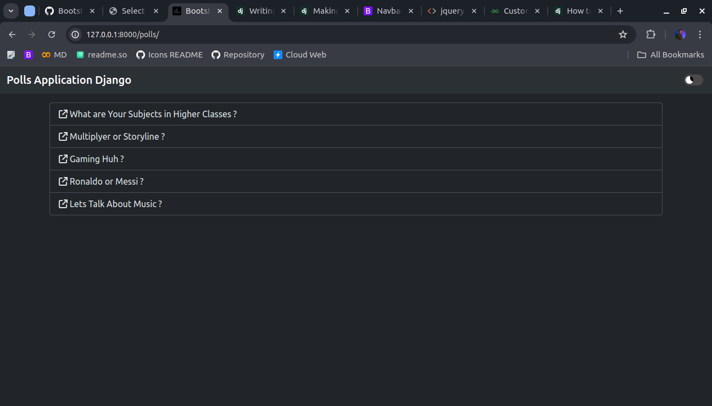
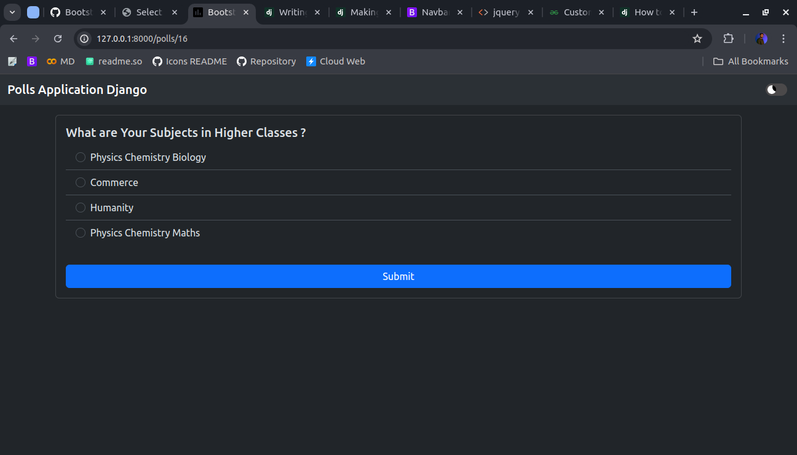
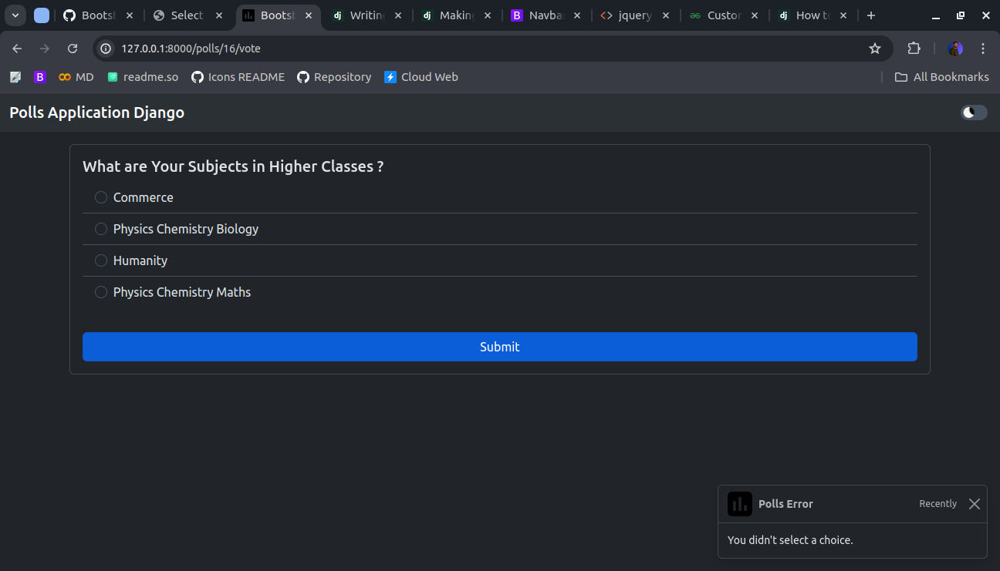
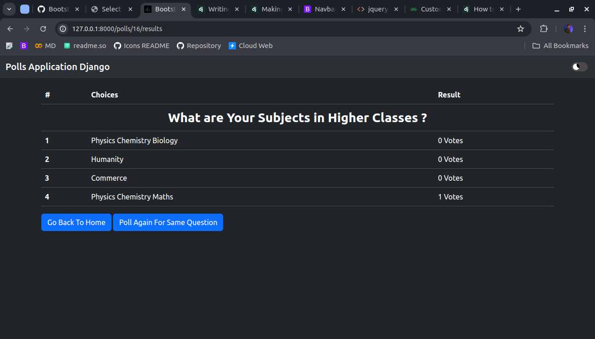

<link href="https://maxcdn.bootstrapcdn.com/bootstrap/3.3.6/css/bootstrap.min.css" rel="stylesheet" />

# Working Views

Now lets see Some views with some functionality like,

1. On `index` We will see Some lastest questions.
2. On `details` we will See Details of questions i.e. choices.
3. On `vote` we will add functionality and add vote to that choice.
4. On `result` we will add results which display the choices with results.

***Check `Django Admin` Module Where we discussed about how to add data in our models***

## Sample Directory View

```bash
.
├── db.sqlite3
├── manage.py
├── mysite
│   ├── asgi.py
│   ├── __init__.py
│   ├── settings.py
│   ├── urls.py
│   └── wsgi.py
├── polls
│   ├── admin.py
│   ├── apps.py
│   ├── __init__.py
│   ├── migrations
│   │   ├── 0001_initial.py
│   │   ├── __init__.py
│   ├── models.py
│   ├── templatetags
│   │   ├── __init__.py
│   │   └── shuffle.py
│   ├── tests.py
│   ├── urls.py
│   └── views.py
└── templates
    ├── index.html
    ├── polls
    │   ├── details.html
    │   ├── home.html
    │   └── results.html
    └── static
        ├── images
        │   └── polls.png
        ├── scripts.js
        └── style.css
```

## *We Are Using Bootstrap Components to Display Data*

## Index View

So Index View Required Question Model, so import `question` model and use question model data to pass as arguments in template.

    def index(request):
        questions = Question.objects.order_by["-pub_date"](:5)
        return render(request, "polls/home.html", {"questions": questions})

Update `polls/home.html` for corresponsing data arguments

    <div class="list-group">
        
        
        <a type="button" href="" class="list-group-item list-group-item-action">
            <i class="fa fa-arrow-up-right-from-square"></i><span> {{question.question_text}}</span></>
            
            
            <button type="button" class="list-group-item list-group-item-action">
                NO QUESTIONS AVAILABLE
            </button>
            
    </div>

This Will Show the last five data on index page



## Details View

Now Lets Update `Detail` View to Show Details and Corresponding Choices for the Question

    def detail(request, question_id):
        question = get_object_or_404(Question, pk=question_id)
        return render(request, "polls/details.html", {"question": question})

Now this will Provide the Information based on question_id wee pass as argument in url like `polls/5`

Lets Update template for `polls/details.html`

    <form class="card mb-3" action="" method="post">
        
        <div class="card-body">
            <h5 class="card-title">{{question}}</h5>
            <ul class="list-group list-group-flush">
                
                <li class="list-group-item">
                    <input class="form-check-input me-1" type="radio" name="questionChoice" id="firstRadio"
                        value="{{choice.id}}">
                    <label class="form-check-label" for="firstRadio">{{choice.choice_text}}</label>
                </li>
                
            </ul>
        </div>
        <button type="submit" class="btn btn-primary m-3">Submit</button>
    </form>

Here we will be using form and action of the form is `vote` which is our view which we use to add vote to that choice.



## Vote View

Now lets See what we to do in Vote View to Add the vote to Choice

    def vote(request, question_id):
        question = get_object_or_404(Question, pk=question_id)
        try:
            selected_choice = question.choice_set.get(pk=request.POST["questionChoice"])
        except (KeyError, Choice.DoesNotExist):
            return render(
                request,
                "polls/details.html",
                {
                    "question": question,
                    "error_message": "You didn't select a choice.",
                },
            )
        selected_choice.votes = F("votes") + 1
        selected_choice.save()
        return redirect(f"/polls/{question_id}/results")

Now This function view `vote` will update the choice of the view. No Need to Update Template just update details template such that if user submit the form without choice it just through error message.

    
    <div class="toast-container position-fixed bottom-0 end-0 p-3" id="toastContainer">
        <div id="liveToast" class="toast fade show" role="alert" aria-live="assertive" aria-atomic="true"
            data-autohide="true">
            <div class="toast-header">
                
                <strong class="me-auto">Polls Error</strong>
                <small>Recently</small>
                <button type="button" class="btn-close" data-bs-dismiss="toast" aria-label="Close"></button>
            </div>
            <div class="toast-body">
                {{error_message}}
            </div>
        </div>
    </div>
    
    <script>
        document.addEventListener("DOMContentLoaded", () => {
            const toast = document.getElementById("toastContainer");
            setTimeout(() => {
                if (toast) {
                    toast.style.display = "none";
                };
            }, 3000);
        });
    </script>

Toast Component is Used to Display the Error Message Which will hide by itself using javascript.



## Result View

Lets Now Update Our Last View Result View Which will use to show the results.

    def results(request, question_id):
        question = get_object_or_404(Question, pk=question_id)
        return render(request, "polls/results.html", {"question": question})

Update Curresponsing Template `polls/results.html`

    <table class="table table-hover">
        <thead>
            <tr>
                <th scope="col">#</th>
                <th scope="col">Choices</th>
                <th scope="col">Result</th>
            </tr>
        </thead>
        <tbody>
            <tr>
                <th colspan="3" class="text-center fs-3">{{question.question_text}}</th>
            </tr>
            
            <tr>
                <th>{{forloop.counter}}</th>
                <td>{{choice.choice_text}}</td>
                <td>{{choice.votes}} Votes</td>
            </tr>
            
        </tbody>
    </table>
    <a type="button" href="/polls" class="btn btn-primary">Go Back To Home</a>
    <a type="button" href="" class="btn btn-primary">Poll Again For Same Question</a>

Bootstrap Table Component is used to show the Results Data.



## *Now Here Many Quetion Arises how to use if-else statement in django-templates, looping in django templates, Template Filter, Forms Action, How to Get Form data in Views, and many more, Lets Understand Each One-By-One*
