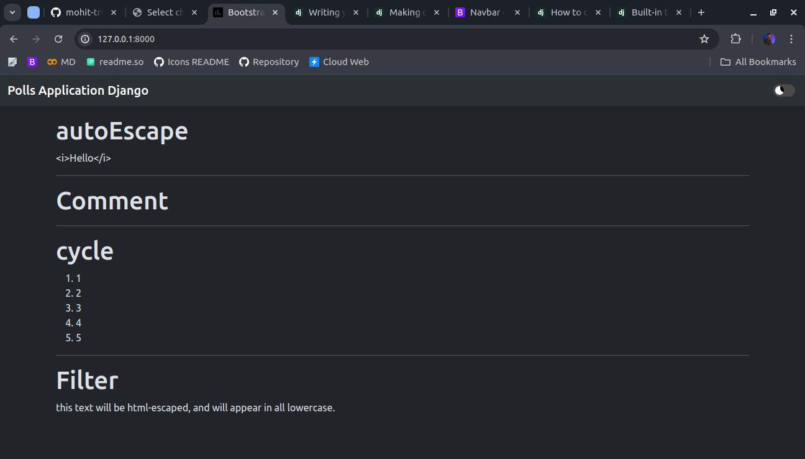
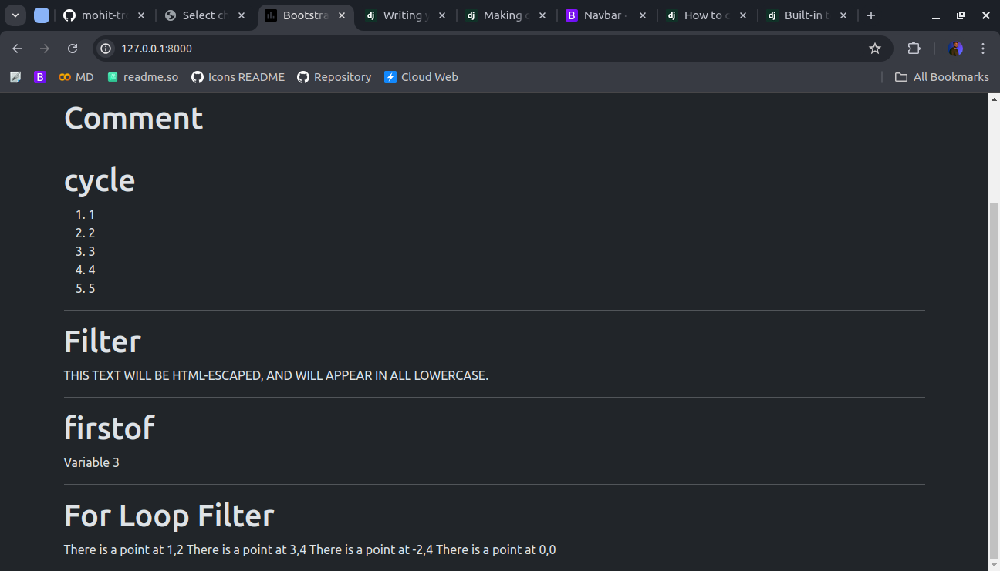

<link href="https://maxcdn.bootstrapcdn.com/bootstrap/3.3.6/css/bootstrap.min.css" rel="stylesheet" />

# Overview

Django Template Engine provides filters which are used to transform the values of variables and tag arguments. We have already discussed major Django Template Tags. Tags can't modify value of a variable whereas filters can be used for incrementing value of a variable or modifying it to one's own need

## autoescape

Controls the current auto-escaping behavior. This tag takes either on or off as an argument and that determines whether auto-escaping is in effect inside the block. The block is closed with an endautoescape ending tag.

    def index(request):
        return render(request, "index.html", {"titleTest": "<i>Hello</i>"})

1. autoescape off

        
        {{titleTest}}
        

2. autoescape on

        
        {{titleTest}}
        

## comment

Ignores everything between  and . An optional note may be inserted in the first tag. For example, this is useful when commenting out code for documenting why the code was disabled.

        
        
Commented out text with {{ create_date|date:"c" }}

        

Without Comment

With Comment

## csrf_token

This tag is used for CSRF protection,

## cycle

Produces one of its arguments each time this tag is encountered. The first argument is produced on the first encounter, the second argument on the second encounter, and so forth. Once all arguments are exhausted, the tag cycles to the first argument and produces it again.

        <ol>
            
            <li class="">
                {{o}}
            </li>
            
        </ol>

## Filter

Filters the contents of the block through one or more filters. Multiple filters can be specified with pipes and filters can have arguments, just as in variable syntax.

        
            This text will be HTML-escaped, and will appear in all lowercase.
        

## firstoff

Outputs the first argument variable that is not “false” (i.e. exists, is not empty, is not a false boolean value, and is not a zero numeric value). Outputs nothing if all the passed variables are “false”.

        

This is equivalent to:

        
            {{ var1 }}
        
            {{ var2 }}
        
            {{ var3 }}
        

Example Arguments

        {
            "titleTest": "<i>Hello</i>",
            "create_date": datetime.now(),
            "some_list": [1, 2, 3, 4, 5],
            # "var1": "variable 1",
            "var3": "Variable 3",
        },

Output

## for loop filter

Loops over each item in an array, making the item available in a context variable. For example, to display a list of athletes provided in athlete_list:

    
        There is a point at {{ x }},{{ y }}
    

The for loop sets a number of variables available within the loop:

| Variable          |    Description                                                          |
|-------------------|-------------------------------------------------------------------------|
|forloop.counter    | The current iteration of the loop (1-indexed)                           |
|forloop.counter0   | The current iteration of the loop (0-indexed)                           |
|forloop.revcounter | The number of iterations from the end of the loop (1-indexed)           |
|forloop.revcounter0| The number of iterations from the end of the loop (0-indexed)           |
|forloop.first      | True if this is the first time through the loop                         |
|forloop.last       | True if this is the last time through the loop                          |
|forloop.parentloop | For nested loops, this is the loop surrounding the current one          |

## if

The `` tag evaluates a variable, and if that variable is “true” (i.e. exists, is not empty, and is not a false boolean value) the contents of the block are output:

        
            Number of athletes: {{ athlete_list|length }}
        
            Athletes should be out of the locker room soon!
        
            No athletes.
        

`{{ variable|length }}` return the size of iterable

<table class="table table-hover text-center">
    <thead>
        <tr>
            <th>Operator</th>
            <th>Description</th>
        </tr>
    </thead>
    <tbody>
        <tr>
            <td>==</td>
            <td>Equility</td>
        </tr>
        <tr>
            <td>!=</td>
            <td>Inequility</td>
        </tr>
        <tr>
            <td><</td>
            <td>Less Than</td>
        </tr>
        <tr>
            <td><</td>
            <td>Less Than</td>
        </tr>
        <tr>
            <td><</td>
            <td>Less Than</td>
        </tr>
        <tr>
            <td>></td>
            <td>Greater Than</td>
        </tr>
        <tr>
            <td><=</td>
            <td>Less Than Equal to</td>
        </tr>
        <tr>
            <td>in</td>
            <td>Contained within</td>
        </tr>
        <tr>
            <td>not in</td>
            <td>Not Contained within</td>
        </tr>
        <tr>
            <td>is</td>
            <td>Object Identified</td>
        </tr>
        <tr>
            <td>is not</td>
            <td>Object Not Identified</td>
        </tr>
        <tr>
            <td>or</td>
            <td>Bitwise or Operator</td>
        </tr>
        <tr>
            <td>and</td>
            <td>Bitwise and Operator</td>
        </tr>
        <tr>
            <td>not</td>
            <td>Bitwise not Operator</td>
        </tr>
    </tbody>
</table>

## includes

Loads a template and renders it with the current context. This is a way of “including” other templates within a template.

        

        

You can pass additional context to the template using keyword arguments:

        
If you want to render the context only with the variables provided (or even no variables at all), use the only option. No other variables are available to the included template:

        

## load

Loads a custom template tag set.

For example, the following template would load all the tags and filters registered in somelibrary and otherlibrary located in package package:

        
        

## lorem

Displays random “lorem ipsum” Latin text. This is useful for providing sample data in templates.

        

## now

Displays the current date and/or time, using a format according to the given string.

    It is 

***Available format strings:***

<table class="table table-hover text-center">
    <thead class="thead-dark">
    <tr>
        <th>Format character</th>
        <th>Description</th>
        <th>Example output</th>
    </tr>
    </thead>
    <tbody>
    <tr>
        <td>d</td>
        <td>Day of the month, 2 digits with leading zeros.</td>
        <td>'01' to '31'</td>
    </tr>
    <tr>
        <td>j</td>
        <td>Day of the month without leading zeros.</td>
        <td>'1' to '31'</td>
    </tr>
    <tr>
        <td>D</td>
        <td>Day of the week, textual, 3 letters.</td>
        <td>'Fri'</td>
    </tr>
    <tr>
        <td>l</td>
        <td>Day of the week, textual, long.</td>
        <td>'Friday'</td>
    </tr>
    <tr>
        <td>S</td>
        <td>English ordinal suffix for day of the month, 2 characters.</td>
        <td>'st', 'nd', 'rd' or 'th'</td>
    </tr>
    <tr>
        <td>w</td>
        <td>Day of the week, digits without leading zeros.</td>
        <td>'0' (Sunday) to '6' (Saturday)</td>
    </tr>
    <tr>
        <td>z</td>
        <td>Day of the year.</td>
        <td>1 to 366</td>
    </tr>
    <tr>
        <td>W</td>
        <td>ISO-8601 week number of year, with weeks starting on Monday.</td>
        <td>1, 53</td>
    </tr>
    <tr>
        <td>m</td>
        <td>Month, 2 digits with leading zeros.</td>
        <td>'01' to '12'</td>
    </tr>
    <tr>
        <td>n</td>
        <td>Month without leading zeros.</td>
        <td>'1' to '12'</td>
    </tr>
    <tr>
        <td>M</td>
        <td>Month, textual, 3 letters.</td>
        <td>'Jan'</td>
    </tr>
    <tr>
        <td>b</td>
        <td>Month, textual, 3 letters, lowercase.</td>
        <td>'jan'</td>
    </tr>
    <tr>
        <td>E</td>
        <td>Month, locale specific alternative representation.</td>
        <td>'listopada'</td>
    </tr>
    <tr>
        <td>F</td>
        <td>Month, textual, long.</td>
        <td>'January'</td>
    </tr>
    <tr>
        <td>N</td>
        <td>Month abbreviation in Associated Press style.</td>
        <td>'Jan.', 'Feb.', 'March', 'May'</td>
    </tr>
    <tr>
        <td>t</td>
        <td>Number of days in the given month.</td>
        <td>28 to 31</td>
    </tr>
    <tr>
        <td>y</td>
        <td>Year, 2 digits with leading zeros.</td>
        <td>'00' to '99'</td>
    </tr>
    <tr>
        <td>Y</td>
        <td>Year, 4 digits with leading zeros.</td>
        <td>'0001' to '9999'</td>
    </tr>
    <tr>
        <td>L</td>
        <td>Boolean for whether it’s a leap year.</td>
        <td>True or False</td>
    </tr>
    <tr>
        <td>o</td>
        <td>ISO-8601 week-numbering year.</td>
        <td>'1999'</td>
    </tr>
    <tr>
        <td>g</td>
        <td>Hour, 12-hour format without leading zeros.</td>
        <td>'1' to '12'</td>
    </tr>
    <tr>
        <td>G</td>
        <td>Hour, 24-hour format without leading zeros.</td>
        <td>'0' to '23'</td>
    </tr>
    <tr>
        <td>h</td>
        <td>Hour, 12-hour format with leading zeros.</td>
        <td>'01' to '12'</td>
    </tr>
    <tr>
        <td>H</td>
        <td>Hour, 24-hour format with leading zeros.</td>
        <td>'00' to '23'</td>
    </tr>
    <tr>
        <td>i</td>
        <td>Minutes with leading zeros.</td>
        <td>'00' to '59'</td>
    </tr>
    <tr>
        <td>s</td>
        <td>Seconds with leading zeros.</td>
        <td>'00' to '59'</td>
    </tr>
    <tr>
        <td>u</td>
        <td>Microseconds.</td>
        <td>000000 to 999999</td>
    </tr>
    <tr>
        <td>a</td>
        <td>'a.m.' or 'p.m.'</td>
        <td>'a.m.'</td>
    </tr>
    <tr>
        <td>A</td>
        <td>'AM' or 'PM'</td>
        <td>'AM'</td>
    </tr>
    <tr>
        <td>f</td>
        <td>Time in 12-hour hours and minutes.</td>
        <td>'1', '1:30'</td>
    </tr>
    <tr>
        <td>P</td>
        <td>Time in 12-hour hours and minutes with 'a.m.'/'p.m.'</td>
        <td>'1 a.m.', '1:30 p.m.', 'midnight', 'noon'</td>
    </tr>
    <tr>
        <td>e</td>
        <td>Timezone name.</td>
        <td>'', 'GMT', '-500', 'US/Eastern'</td>
    </tr>
    <tr>
        <td>I</td>
        <td>Daylight saving time, whether it’s in effect or not.</td>
        <td>'1' or '0'</td>
    </tr>
    <tr>
        <td>O</td>
        <td>Difference to Greenwich time in hours.</td>
        <td>'+0200'</td>
    </tr>
    <tr>
        <td>T</td>
        <td>Time zone of this machine.</td>
        <td>'EST', 'MDT'</td>
    </tr>
    <tr>
        <td>Z</td>
        <td>Time zone offset in seconds.</td>
        <td>-43200 to 43200</td>
    </tr>
    <tr>
        <td>c</td>
        <td>ISO 8601 format.</td>
        <td>'2008-01-02T10:30:00.000123+02:00'</td>
    </tr>
    <tr>
        <td>r</td>
        <td>RFC 5322 formatted date.</td>
        <td>'Thu, 21 Dec 2000 16:01:07 +0200'</td>
    </tr>
    <tr>
        <td>U</td>
        <td>Seconds since the Unix Epoch.</td>
        <td></td>
    </tr>
    </tbody>
</table>

## regroup

Regroups a list of alike objects by a common attribute.

This complex tag is best illustrated by way of an example: say that cities is a list of cities represented by dictionaries containing "name", "population", and "country" keys:

Example Data -

        cities = [
            {"name": "Mumbai", "population": "19,000,000", "country": "India"},
            {"name": "Calcutta", "population": "15,000,000", "country": "India"},
            {"name": "New York", "population": "20,000,000", "country": "USA"},
            {"name": "Chicago", "population": "7,000,000", "country": "USA"},
            {"name": "Tokyo", "population": "33,000,000", "country": "Japan"},
        ]

Template Tag -

        

        <ul>
        
            <li>{{ country.grouper }}
            <ul>
                
                <li>{{ city.name }}: {{ city.population }}</li>
                
            </ul>
            </li>
        
        </ul>

## dictsort filter

To sort the data in the template using the dictsort filter, if your data is in a list of dictionaries:

        

## resetcycle

Resets a previous cycle so that it restarts from its first item at its next encounter. Without arguments, `` will reset the last `` defined in the template.

        
        
{{ city }}

        
        

With Reset Cycle --

Without Reset Cycle --

## spaceless

Removes whitespace between HTML tags. This includes tab characters and newlines.

    
        

            <a href="foo/">Foo</a>
        

    
This would return this HTML:

    
<a href="foo/">Foo</a>

Only space between tags is removed – not space between tags and text. In this example, the space around Hello won’t be stripped:

    
        <strong>
            Hello
        </strong>
    

## templatetag

Outputs one of the syntax characters used to compose template tags.

Argument Outputs

- openblock: 
- openvariable: {{
- closevariable: }}
- openbrace: {
- closebrace: }
- opencomment: {#
- closecomment: #}

## url

Returns an absolute path reference (a URL without the domain name) matching a given view and optional parameters. Any special characters in the resulting path will be encoded using iri_to_uri().

    

This is the Example url such that 'some-url-name' refers to corresponsing url name and v1 & v2 are argument1 & argument2 respectively.

## with

Caches a complex variable under a simpler name. This is useful when accessing an “expensive” method (e.g., one that hits the database) multiple times.

        
            {{ total }} employee{{ total|pluralize }}
        

# Built in References

## add

Adds the argument to the value.

    {{ value|add:"2" }}
If value is 4, then the output will be 6.

    {{ first|add:second }}
and first is [1, 2, 3] and second is [4, 5, 6], then the output will be [1, 2, 3, 4, 5, 6].

## addslashes

Adds slashes before quotes. Useful for escaping strings in CSV, for example.

    {{ value|addslashes }}
If value is "I'm using Django", the output will be "I\'m using Django".

## capfirst

Capitalizes the first character of the value. If the first character is not a letter, this filter has no effect.

    {{ value|capfirst }}
If value is "django", the output will be "Django".

## center

Centers the value in a field of a given width.

    "{{ value|center:"15" }}"
If value is "Django", the output will be "     Django    ".

## cut

Removes all values of arg from the given string.

    {{ value|cut:" " }}
If value is "String with spaces", the output will be "Stringwithspaces".

## default

If value evaluates to False, uses the given default. Otherwise, uses the value.

## default_if_none

If (and only if) value is None, uses the given default. Otherwise, uses the value.

    {{ value|default_if_none:"nothing" }}
If value is None, the output will be nothing.

## dictsort

Takes a list of dictionaries and returns that list sorted by the key given in the argument.

    {{ value|dictsort:"name" }}
If value is:

    [
        {"name": "zed", "age": 19},
        {"name": "amy", "age": 22},
        {"name": "joe", "age": 31},
    ]
then the output would be:

    [
        {"name": "amy", "age": 22},
        {"name": "joe", "age": 31},
        {"name": "zed", "age": 19},
    ]

## dictsortreversed

Takes a list of dictionaries and returns that list sorted in reverse order by the key given in the argument. This works exactly the same as the above filter, but the returned value will be in reverse order.

## divisibleby

Returns True if the value is divisible by the argument.

    {{ value|divisibleby:"3" }}
If value is 21, the output would be True.

## filesizeformat

Formats the value like a ‘human-readable’ file size (i.e. '13 KB', '4.1 MB', '102 bytes', etc.).

    {{ value|filesizeformat }}
If value is 123456789, the output would be 117.7 MB.

## floatformat

When used without an argument, rounds a floating-point number to one decimal place – but only if there’s a decimal part to be displayed.

<h2>floatformat Filter Examples</h2>
    <table class="table table-hover text-center">
      <thead class="thead-dark">
        <tr>
          <th>Value</th>
          <th>Template</th>
          <th>Output</th>
        </tr>
      </thead>
      <tbody>
        <tr>
          <td>34.23234</td>
          <td>{{ value|floatformat }}</td>
          <td>34.2</td>
        </tr>
        <tr>
          <td>34.00000</td>
          <td>{{ value|floatformat }}</td>
          <td>34</td>
        </tr>
        <tr>
          <td>34.26000</td>
          <td>{{ value|floatformat }}</td>
          <td>34.3</td>
        </tr>
        <tr>
          <td>34.23234</td>
          <td>{{ value|floatformat:3 }}</td>
          <td>34.232</td>
        </tr>
        <tr>
          <td>34.00000</td>
          <td>{{ value|floatformat:3 }}</td>
          <td>34.000</td>
        </tr>
        <tr>
          <td>34.26000</td>
          <td>{{ value|floatformat:3 }}</td>
          <td>34.260</td>
        </tr>
        <tr>
          <td>34.23234</td>
          <td>{{ value|floatformat:"0" }}</td>
          <td>34</td>
        </tr>
        <tr>
          <td>34.00000</td>
          <td>{{ value|floatformat:"0" }}</td>
          <td>34</td>
        </tr>
        <tr>
          <td>39.56000</td>
          <td>{{ value|floatformat:"0" }}</td>
          <td>40</td>
        </tr>
        <tr>
          <td>34.23234</td>
          <td>{{ value|floatformat:"-3" }}</td>
          <td>34.232</td>
        </tr>
        <tr>
          <td>34.00000</td>
          <td>{{ value|floatformat:"-3" }}</td>
          <td>34</td>
        </tr>
        <tr>
          <td>34.26000</td>
          <td>{{ value|floatformat:"-3" }}</td>
          <td>34.260</td>
        </tr>
        <tr>
          <td>34232.34</td>
          <td>{{ value|floatformat:"2g" }}</td>
          <td>34,232.34</td>
        </tr>
        <tr>
          <td>34232.06</td>
          <td>{{ value|floatformat:"g" }}</td>
          <td>34,232.1</td>
        </tr>
        <tr>
          <td>34232.00</td>
          <td>{{ value|floatformat:"-3g" }}</td>
          <td>34,232</td>
        </tr>
        <tr>
          <td>34.23234</td>
          <td>{{ value|floatformat:"3" }}</td>
          <td>34,232</td>
        </tr>
        <tr>
          <td>34.23234</td>
          <td>{{ value|floatformat:"3u" }}</td>
          <td>34.23</td>
        </tr>
      </tbody>
    </table>

## get_digit

Given a whole number, returns the requested digit, where 1 is the right-most digit, 2 is the second-right-most digit, etc. Returns the original value for invalid input (if input or argument is not an integer, or if argument is less than 1). Otherwise, output is always an integer.

For example:

    {{ value|get_digit:"2" }}
If value is 123456789, the output will be 8.

## join

Joins a list with a string, like Python’s str.join(list)

    {{ value|join:" // " }}
If value is the list ['a', 'b', 'c'], the output will be the string "a // b // c".

## json_script¶

Safely outputs a Python object as JSON, wrapped in a ``
The resulting data can be accessed in JavaScript like this:

`const value = JSON.parse(document.getElementById('hello-data').textContent);`

## make_list

Returns the value turned into a list. For a string, it’s a list of characters. For an integer, the argument is cast to a string before creating a list.

For example:

    {{ value|make_list }}
If value is the string "Joel", the output would be the list ['J', 'o', 'e', 'l']. If value is 123, the output will be the list ['1', '2', '3'].

## phone2numeric

Converts a phone number (possibly containing letters) to its numerical equivalent.

The input doesn’t have to be a valid phone number. This will happily convert any string.

    {{ value|phone2numeric }}
If value is 800-COLLECT, the output will be 800-2655328.

## pluralize

Returns a plural suffix if the value is not 1, '1', or an object of length 1. By default, this suffix is 's'.

Examples

    {{ num_messages|pluralize }}
    {{ num_walruses|pluralize:"es" }}
    {{ num_cherries|pluralize:"y,ies" }}

## random

Returns a random item from the given list.

    {{ value|random }}

## slice

Returns a slice of the list.

Uses the same syntax as Python’s list slicing. See the Python documentation for an introduction.

    {{ some_list|slice:":2" }}
If some_list is ['a', 'b', 'c'], the output will be ['a', 'b'].

## slugify

Converts to ASCII. Converts spaces to hyphens. Removes characters that aren’t alphanumerics, underscores, or hyphens. Converts to lowercase. Also strips leading and trailing whitespace.

    {{ value|slugify }}
If value is "Joel is a slug", the output will be "joel-is-a-slug".

## timesince

Formats a date as the time since that date (e.g., “4 days, 6 hours”).

Takes an optional argument that is a variable containing the date to use as the comparison point (without the argument, the comparison point is now). For example, if blog_date is a date instance representing midnight on 1 June 2006, and comment_date is a date instance for 08:00 on 1 June 2006, then the following would return “8 hours”:

## timeuntil

Similar to timesince, except that it measures the time from now until the given date or datetime. For example, if today is 1 June 2006 and conference_date is a date instance holding 29 June 2006, then {{ conference_date|timeuntil }} will return “4 weeks”.

Takes an optional argument that is a variable containing the date to use as the comparison point (instead of now). If from_date contains 22 June 2006, then the following will return “1 week”:

    {{ conference_date|timeuntil:from_date }}

## title

Converts a string into titlecase by making words start with an uppercase character and the remaining characters lowercase. This tag makes no effort to keep “trivial words” in lowercase.

    {{ value|title }}
If value is "my FIRST post", the output will be "My First Post".

## upper

Converts a string into all uppercase.

    {{ value|upper }}
If value is "Joel is a slug", the output will be "JOEL IS A SLUG".
