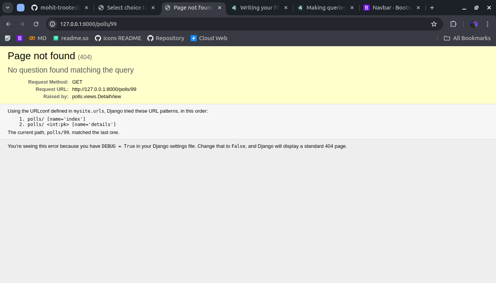

<link href="https://maxcdn.bootstrapcdn.com/bootstrap/3.3.6/css/bootstrap.min.css" rel="stylesheet" />

# Raising 404 Error

The most common error in https is 404 - Resource not found error, not every time the data we requested is present there, so we require a method to raise a 404 and handle this error efficiently.
Now, let’s tackle the question detail view – the page that displays the question text for a given poll.

    def detail(request, question_id):
        try:
            question = Question.objects.get(pk=question_id)
        except Question.DoesNotExist:
            raise Http404("Question does not exist")
        return render(request, "polls/detail.html", {"question": question})
Using Try Except Block we can Handle a 404 Error.

## A shortcut: get_object_or_404()

It’s a very common idiom to use get() and raise Http404 if the object doesn’t exist. Django provides a shortcut. Here’s the detail() view, rewritten:

    from django.shortcuts import get_object_or_404, render

    from .models import Question
    def detail(request, question_id):
        question = get_object_or_404(Question, pk=question_id)
        return render(request, "polls/detail.html", {"question": question})

The get_object_or_404() function takes a Django model as its first argument and an arbitrary number of keyword arguments, which it passes to the get() function of the model’s manager. It raises Http404 if the object doesn’t exist.

