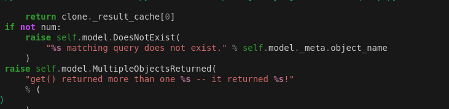

<link href="https://maxcdn.bootstrapcdn.com/bootstrap/3.3.6/css/bootstrap.min.css" rel="stylesheet" />

# What is Django ORM?

So we have came so far and now its time to learn, how django fetches the data from database how its been creating queries?

Lets understand this by taking a good example,

## Database Holding the Students Information

 <table class="table table-hover text-center mx-auto">
        <thead>
            <tr>
                <th>id</th>
                <th>Name</th>
                <th>Age</th>
                <th>City</th>
            </tr>
        </thead>
        <tbody>
            <tr>
                <td>1</td>
                <td>Mohit</td>
                <td>22</td>
                <td>Aburoad</td>
            </tr>
            <tr>
                <td>2</td>
                <td>Abhinav</td>
                <td>24</td>
                <td>Ahmedabad</td>
            </tr>
            <tr>
                <td>3</td>
                <td>Parth</td>
                <td>25</td>
                <td>Jaipur</td>
            </tr>
            <tr>
                <td>4</td>
                <td>Lata</td>
                <td>22</td>
                <td>Delhi</td>
            </tr>
            <tr>
                <td>5</td>
                <td>Shakti</td>
                <td>25</td>
                <td>Mumbai</td>
            </tr>
        </tbody>
    </table>

## Now lets understand the relavent django Model

models.py

    class Student(model.Model):
        id = IntegerField()
        name = CharField(max_length=64)
        age = IntegerField()
        city = CharField(max_length=64)

Now When we Migrate the models the sql query that is running in background is,

    CREATE TABLE students (id SERIAL PRIMARY KEY NOT NULL, name VARCHAR(64) NOT NULL, age INT NOT NULL, city VARCHAR(64) NOT NULL);

## Now What if we want to Create Some Data

so if we want to create data we have to use our model

    student = Student(name="username", age=userage, city="usercity")
    student.save()

So we are seeing some Student data Behind the scenes what is happening here is, Django uses Model to create a Student Object and when we use `.save()` method django databaseapi working in Background to create a sql query for relavent data and executes it.

SQL Query,

    INSERT INTO student (name, age, city) VALUES ("username", userage, "usercity");

## What is we Update the Data

So, at any point of time we require to update the data of user may be user profile updating functionality by the user,

    student = Student.objects.get(pk=userpk)
    student.name = "newname"
    student.save(update_fields=["name"])

Now this will Update the Data of Student but behind the scenes django uses what is happeing here django create a sql query to update the data when we call save method and pass update_fields as a parameter which takes list of fields which we updated.

SQL Query,

    UPDATE students SET name="newname";

## How to Fetch the Data from Database

Now to fetch the datafrom database we have Various Options get a single student entry with specific condition or fetch multiple queries or may be fetch all the data from database.

#### fetch all the data

Now Lets first understand how it will fetch all the data from database, So first write a relevent sql query for this,

    SELECT * FROM students;

 <table class="table table-hover text-center mx-auto">
        <thead>
            <tr>
                <th>id</th>
                <th>Name</th>
                <th>Age</th>
                <th>City</th>
            </tr>
        </thead>
        <tbody>
            <tr>
                <td>1</td>
                <td>Mohit</td>
                <td>22</td>
                <td>Aburoad</td>
            </tr>
            <tr>
                <td>2</td>
                <td>Abhinav</td>
                <td>24</td>
                <td>Ahmedabad</td>
            </tr>
            <tr>
                <td>3</td>
                <td>Parth</td>
                <td>25</td>
                <td>Jaipur</td>
            </tr>
            <tr>
                <td>4</td>
                <td>Lata</td>
                <td>22</td>
                <td>Delhi</td>
            </tr>
            <tr>
                <td>5</td>
                <td>Shakti</td>
                <td>25</td>
                <td>Mumbai</td>
            </tr>
        </tbody>
    </table>

Here is our Sample Data So What we have to write in views,

    students_data = Student.objects.all()

So, `.all()` method is used to fetch the data from database And here works the `Django ORM`

So django maps the each student data into specific object and each object targets the specific corresponding row. From the same table when we run SQL query we get these objects.

    [StudentObject(1), StudentObject(2), StudentObject(3), StudentObject(4), StudentObject(5)]

This is the result of the query, Now Good right Not able to understand the data.

Remember about `__str__` method in Python which is called when we use print/str to convert object into a string. So lets Update the class,

    class Student(model.Model):
        id = IntegerField()
        name = CharField(max_length=64)
        age = IntegerField()
        city = CharField(max_length=64)

    def __str__(self):
        return self.name

Now, When we Call the Object it Returns the Student name rather than unreadable data.

    [<Student: Mohit>, <Choice: Abhinav>, <Choice: Parth Again>, <Choice: Lata>, <Choice: Shanti>]

Looking Good Right Now Each Individual row is Python object and we can work on then efficiently right, That's the beauty of Python and Django

### fetch a specific row from database

Now, What if we want the specific row from the database, lets say the entry with primary key = 1 or may be 2,

*Taking Sample Database as Examples*

    student = Student.objects.get(pk=datapk(2))

Relavent SQL Query,

    SELECT * FROM students WHERE pk = 2;

So, this will return data with pk = 2, and we have data with primary key - 2

    <Student: Abhinav>

What is we dont have that data, Then it will throw Error `Student.DoesNotExist`

### Fetching the Database on Condition

Now, What if we want to fetch multiple objects based on given condition, Lets Take a Example Students with age = 25,

    students = Student.objects.filter(age=25)

Relevent SQL Query,

    SELECT * FROM students where age = 25;

This will return,

    <QuerySet [<Student: Parth>, <Student: Shati>]>

So, This is How it Done, When we Don't Find the data with specific condition it just return empty queryset with no object.

# Difference Between

<table class="table table-hover table-striped-columns">
        <caption>Django QuerySet Methods</caption>
        <thead>
            <tr>
                <th>Method</th>
                <th>Description</th>
                <th>Example</th>
                <th>Returns</th>
                <th>Errors</th>
                <th>Use Case</th>
            </tr>
        </thead>
        <tbody>
            <tr>
                <td>get()</td>
                <td>Retrieves a single object matching the query.</td>
                <td><code>user = User.objects.get(id=1)</code></td>
                <td>Single object or raises an exception.</td>
                <td>DoesNotExist, MultipleObjectsReturned</td>
                <td>Retrieve a unique record, such as by ID.</td>
            </tr>
            <tr>
                <td>all()</td>
                <td>Retrieves all objects for the model.</td>
                <td><code>all_users = User.objects.all()</code></td>
                <td>QuerySet of all objects.</td>
                <td>None specific; may raise DatabaseError</td>
                <td>Get all records, such as listing all users.</td>
            </tr>
            <tr>
                <td>filter()</td>
                <td>Retrieves objects matching specified criteria.</td>
                <td><code>filtered_users = User.objects.filter(age__gt=25)</code></td>
                <td>QuerySet of matching objects.</td>
                <td>None specific; may raise DatabaseError</td>
                <td>Retrieve records matching certain conditions, like age or status.</td>
            </tr>
        </tbody>
    </table>
