<link href="https://maxcdn.bootstrapcdn.com/bootstrap/3.3.6/css/bootstrap.min.css" rel="stylesheet" />

# Django Forms

Django provides a range of tools and libraries to help you build forms to accept input from site visitors, and then process and respond to the input

## HTML Forms

In HTML, a form is a collection of elements inside `<form>...</form>` that allow a visitor to do things like enter text, select options, manipulate objects or controls, and so on, and then send that information back to the server.

Some of these form interface elements - text input or checkboxes - are built into HTML itself. Others are much more complex; an interface that pops up a date picker or allows you to move a slider or manipulate controls will typically use JavaScript and CSS as well as HTML form `<input>` elements to achieve these effects.

As well as its `<input>` elements, a form must specify two things:

- where: the URL to which the data corresponding to the user’s input should be returned
- how: the HTTP method the data should be returned by

As an example, the login form for the Django admin contains several `<input>` elements: one of type="text" for the username, one of type="password" for the password, and one of type="submit" for the “Log in” button. It also contains some hidden text fields that the user doesn’t see, which Django uses to determine what to do next.

## GET and POST

GET and POST are the only HTTP methods to use when dealing with forms.

Django’s login form is returned using the POST method, in which the browser bundles up the form data, encodes it for transmission, sends it to the server, and then receives back its response.

GET and POST are typically used for different purposes.

- Any request that could be used to change the state of the system - for example, a request that makes changes in the database - should use POST. GET should be used only for requests that do not affect the state of the system.

- GET would also be unsuitable for a password form, because the password would appear in the URL, and thus, also in browser history and server logs, all in plain text. Neither would it be suitable for large quantities of data, or for binary data, such as an image. A web application that uses GET requests for admin forms is a security risk: it can be easy for an attacker to mimic a form’s request to gain access to sensitive parts of the system. POST, coupled with other protections like Django’s CSRF protection offers more control over access.

## Django Form Class

Django’s form functionality can simplify and automate vast portions of this work, and can also do it more securely than most programmers would be able to do in code they wrote themselves.

Django handles three distinct parts of the work involved in forms:

preparing and restructuring data to make it ready for rendering
creating HTML forms for the data
receiving and processing submitted forms and data from the client
It is possible to write code that does all of this manually, but Django can take care of it all for you.

### Form Class

Form Class describes the logical structure of an object, its behavior, and the way its parts are represented to us, a Form class describes a form and determines how it works and appears.

### ModelForm Class

A ModelForm maps a model class’s fields to HTML form `<input>` elements via a Form; this is what the Django admin is based upon.

## Building a form

Lets Create a Form Using HTML to Get Username

    <form action="/your-name/" method="post">
        <label for="your_name">Your name: </label>
        <input id="your_name" type="text" name="your_name" value="{{ current_name }}">
        <input type="submit" value="OK">
    </form>
Now lets Build the Same thing using Django Form Class

We already know what we want our HTML form to look like. Our starting point for it in Django is this:

    >>> forms.py
    from django import forms

    class NameForm(forms.Form):
        your_name = forms.CharField(label="Your name", max_length=100)

A Form instance has an `is_valid()` method, which runs validation routines for all its fields. When this method is called, if all fields contain valid data, it will:

place the form’s data in its `cleaned_data` attribute.

Let's Structure Out Views

    class InputForm(FormView):
        template_name = "Temp.html"
        form_class = NameForm

        def form_valid(self, form):
            print(form)
            return super().form_valid(form)

Render this Form in HTML Template,

    <form action="" method="post">
        
        {{form.as_p}}
        <button type="submit">Submit</button>
    </form>

Result Output on HTML

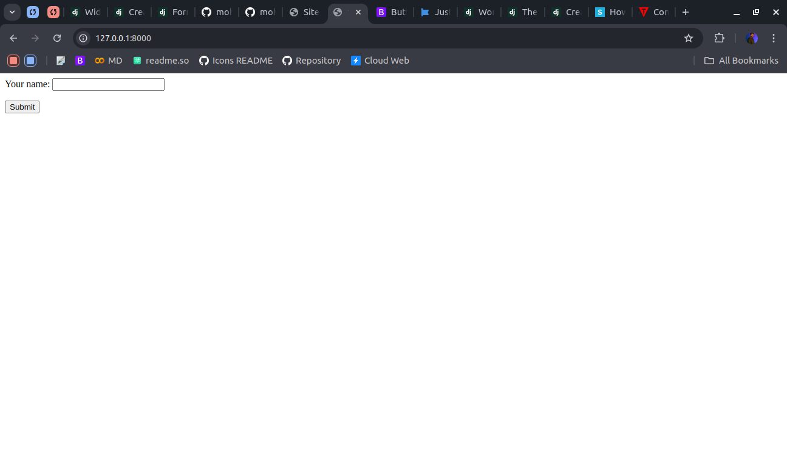

What Happen if we Submit the Form

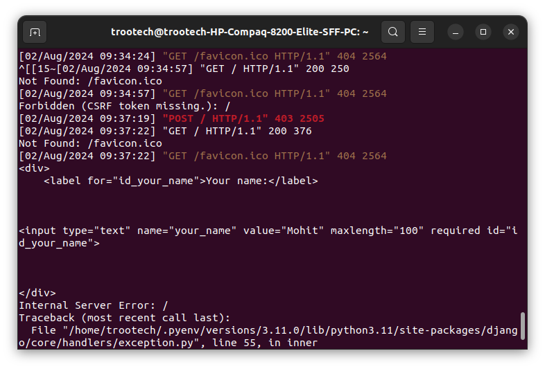

The Form is Submitted and Get the Form in Python `is_valid` Function in the same class, But Ecountered Error, Yes Just Because What to Do When Form is Valid We need Handle Data and Pass the success url for the Data.

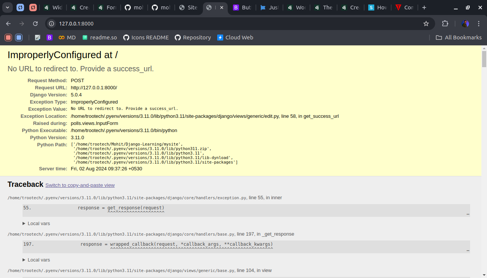

So, Passing Success url is not so big thing just pass the url as Class Attribute in the same `FormView` class

    class InputForm(FormView):
        template_name = "Temp.html"
        form_class = NameForm
        success_url = "/polls"

        def form_valid(self, form):
            print(form)
            return super().form_valid(form)

Now Whenever we Submit the Form, and if valid it redirect to `succes_url` given

So Yes here we are

And here is our form but where is Value Use `request.POST['field_name]` to get the values using input names,

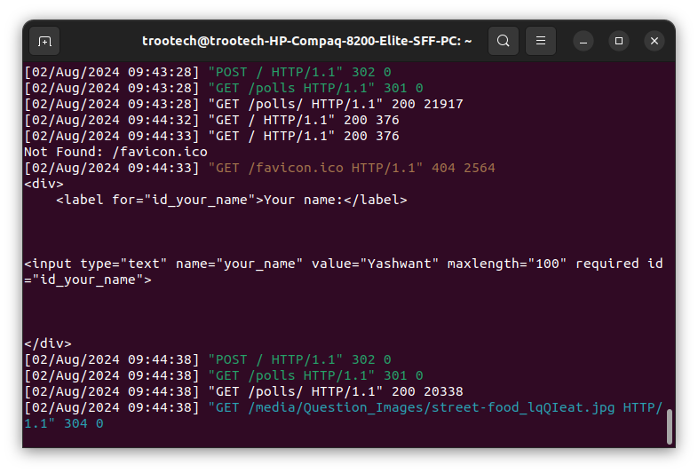

So, Here our input name is your_name

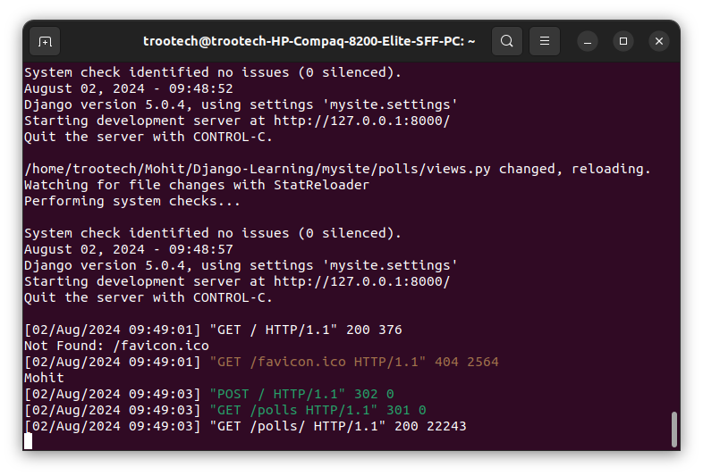

So That's How you Can Handle a Django Form Class

## Form Widgets

Now, Form is created what but now what about styling, classes, labels, help_text.

We all know that the UI/UX is one of the main things now so forms with no styling, Sounds not good right.

Lets use bootstrap `form-label` and `form-control` class to create some styling.

**Remember to add Bootstrap CSS & JS to Template*

Here is Update Form class

    class NameForm(Form):
        username = CharField(
            required=True,
            max_length=30,
            widget=TextInput(
                attrs={"class": "form-control", "placeholder": "Enter Login Username"}
            ),
            label="Enter Username",
            help_text="Username Required",
        )

HTML

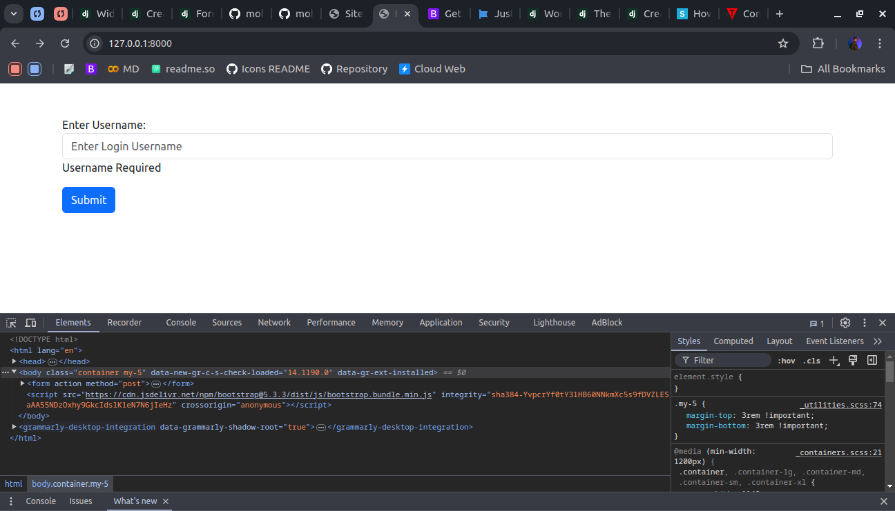

Similarly We can add Custom Styling Classes and Add into Forms,

## Advance Forms with Django

Now Lets Handle the form data in HTML Template and See What we have there.

    <form action="" method="post">
        
        {{form.as_p}}
        <button type="submit" class="btn btn-primary">Submit</button>
    </form>
Second, you can manually render the formset, but let the form deal with itself:

    <form action="" method="post">
        
        

            
            {{ field.label }}
            {{ field }}
            
        

        <button type="submit" class="btn btn-primary">Submit</button>
    </form>
When you manually render the forms yourself, be sure to render the management form as shown above. See the management form documentation.

Third, you can manually render each field:

    <form action="" method="post">
        
        
        

            {{ field }}
            <label for="{{field.id_for_label}}">{{field.label}}</label>
        

        
        <button type="submit" class="btn btn-primary">Submit</button>
    </form>
**Remember About csrf_token when working with post request*

Now, This is a Well Structured Form

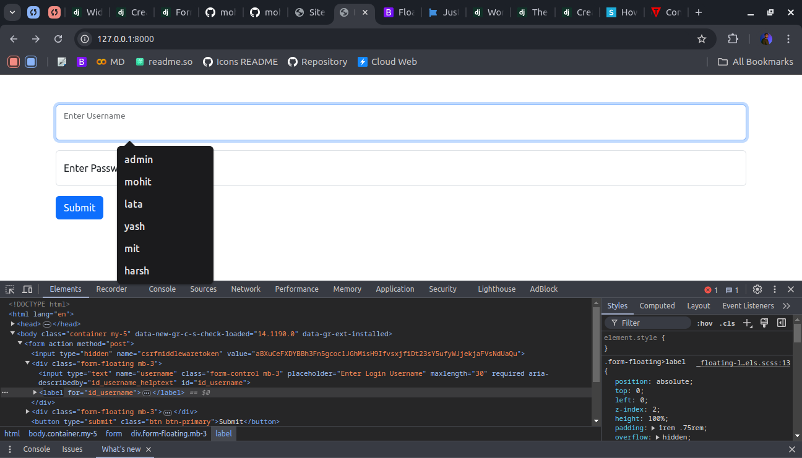

Let's Try to Add Bootstrap Form Validation in Django Form

HTML Template

    <form action="" method="post" class="needs-validation" novalidate>
        
        
        

            {{ field }}
            <label for="{{field.id_for_label}}">{{field.label}}</label>
            

                {{field.help_text}}
            

        

        
        <button type="submit" class="btn btn-primary">Submit</button>
    </form>

Script For Validation

    

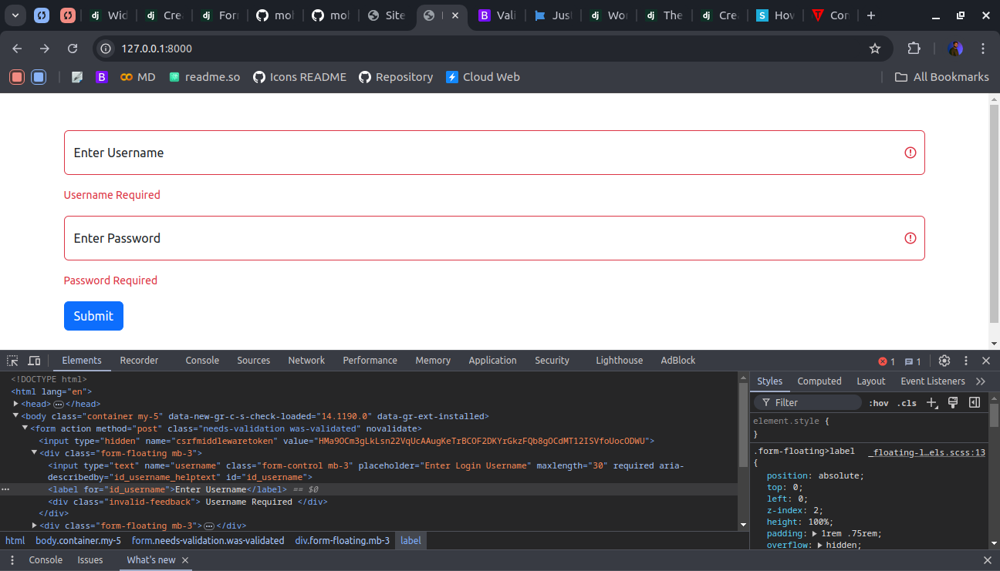

**This is Client Side Validation a Good Server Side Validation is Also Required to Submit Form*

## Raise Error in Forms

Now, When we have server side Validation We Require to Have Error Template to Show the Error to User, We Using Bootstrap Alert Component to Learn This.

    

    A simple danger alert—check it out!
    

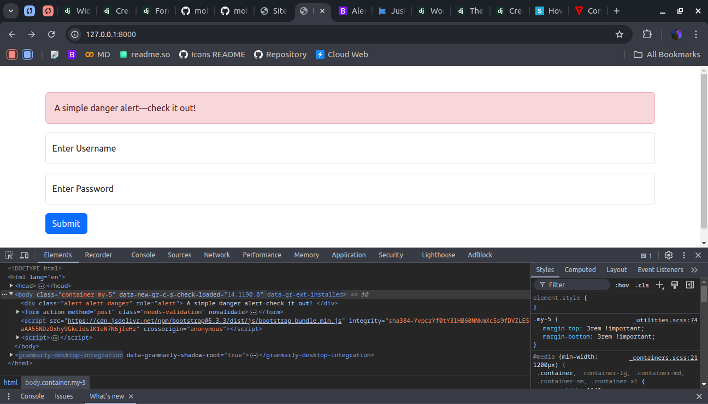

Good, Looking But Only Show this Alert if Error So here is Error Template For HTML

    

        
            
            <strong>{{ error|escape }}</strong>
            
            
            
            <strong>{{ error|escape }}</strong>
        
    

Here is the Body Tag For Reference

    <body class="container my-5">
        
        

            
            
            <strong>{{ error|escape }}</strong>
            
            
            
            <strong>{{ error|escape }}</strong>
            
        

        
        <form action="" method="post" class="needs-validation" novalidate>
            
            
            

                {{ field }}
                <label for="{{field.id_for_label}}">{{field.label}}</label>
                

                    {{field.help_text}}
                

            

            
            <button type="submit" class="btn btn-primary">Submit</button>
        </form>

        
    </body>

Let's Create a Server Side Validation for Password Should be Eight Digit, One Small Character, One Capital Character, One Number, One Special Chracter

### Template

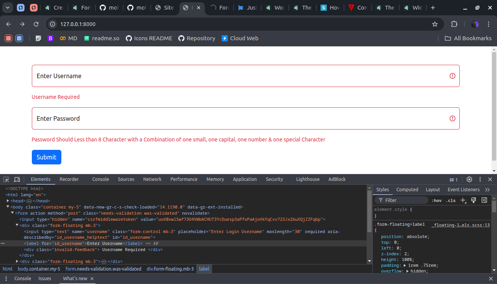

### Views

    class InputForm(FormView):
        template_name = "Temp.html"
        form_class = NameForm
        success_url = "/polls"

        def form_valid(self, form):
            username = self.request.POST["username"]
            password = self.request.POST["password"]
            validate_password = validate(password)
            if not validate_password:
                form.add_error(None, "Please Enter Password In Required Format.")
                return super().form_invalid(form)
            print("Valid Successfully", username, password)
            return super().form_valid(form)

### Validation Function

    def find_pattern(patt, text):
            m = re.search(patt, text)
            if m:
                return True
            else:
                return False

        def validate(password: str) -> bool:
            """
            Password Validation

            :param password: str
            :return: bool
            """
            if 6 < len(password) < 13:
                if (
                    find_pattern(r"[A-Z]", password)
                    and find_pattern(r"[a-z]", password)
                    and find_pattern(r"\d", password)
                    and find_pattern(r"[$#A]", password)
                ):
                    return True
                else:
                    return False
            else:
                return False
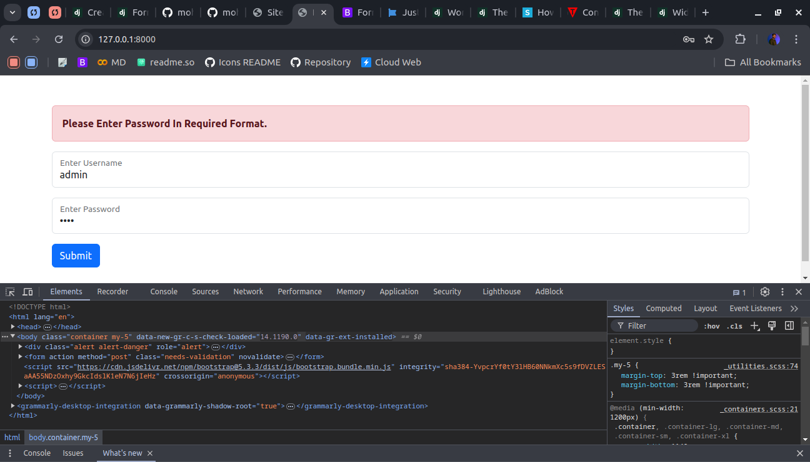

So That's How a Form Class Work in Django

**Now lets Understand Widgets in Form Class*