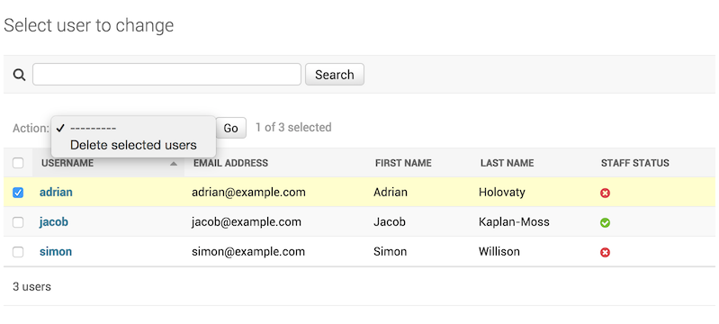
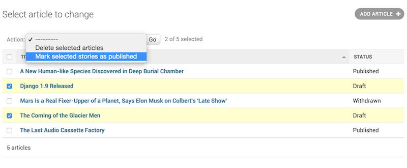
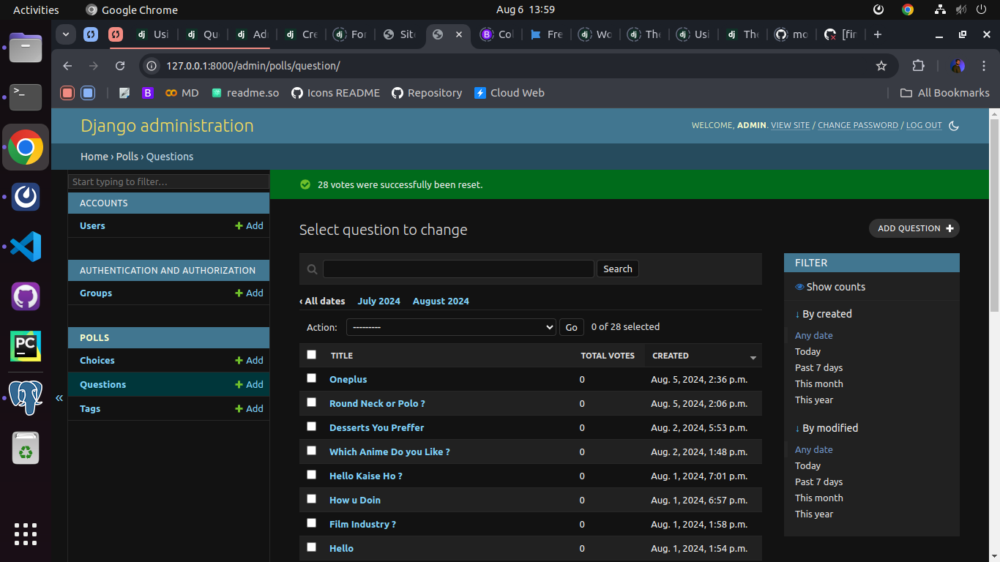

<link href="https://maxcdn.bootstrapcdn.com/bootstrap/3.3.6/css/bootstrap.min.css" rel="stylesheet" />

# Admin Action

We already seen our admin panel, Lets create some admin actions for admin page.

Django’s admin lets you write and register “actions” – functions that get called with a list of objects selected on the change list page.

If you look at any change list in the admin, you’ll see this feature in action; Django ships with a “delete selected objects” action available to all models. For example, here’s the user module from Django’s built-in django.contrib.auth app:



Sample Admin Panel

```python
class Article(models.Model):
    title = models.CharField(max_length=100)
    body = models.TextField()
    status = models.CharField(max_length=1, choices=STATUS_CHOICES)

    def __str__(self):
        return self.title
```

### Writing Action Functions

we’ll need to write a function that gets called when the action is triggered from the admin. Action functions are regular functions that take three arguments:

An HttpRequest representing the current request,
A QuerySet containing the set of objects selected by the user.
Our publish-these-articles function won’t need the ModelAdmin or the request object, but we will use the queryset:

```python
from django.contrib import admin

...

@admin.action(description="Mark selected stories as published")
def make_published(modeladmin, request, queryset):
    queryset.update(status="p")
```



### Messages

we can use self to flash a message to the user informing them that the action was successful:

```python
class ArticleAdmin(admin.ModelAdmin):
    ...

    def make_published(self, request, queryset):
        updated = queryset.update(status="p")
            self.message_user(
                request,
                ngettext(
                    "%d story was successfully marked as published.",
                    "%d stories were successfully marked as published.",
                    updated,
                )
                % updated,
                messages.SUCCESS,
            )
```



## Setting permissions for actions

Actions may limit their availability to users with specific permissions by wrapping the action function with the action() decorator and passing the permissions argument:

```python
@admin.action(permissions=["change"])
def make_published(modeladmin, request, queryset):
    queryset.update(status="p")
```

Available values for permissions and the corresponding method checks are:

1. `add`: ModelAdmin.has_add_permission()
2. `change`: ModelAdmin.has_change_permission()
3. `delete`: ModelAdmin.has_delete_permission()
4. `view`: ModelAdmin.has_view_permission()

```python
from django.contrib import admin
from django.contrib.auth import get_permission_codename

class ArticleAdmin(admin.ModelAdmin):
    actions = ["make_published"]

    @admin.action(permissions=["publish"])
    def make_published(self, request, queryset):
        queryset.update(status="p")

    def has_publish_permission(self, request):
        """Does the user have the publish permission?"""
        opts = self.opts
        codename = get_permission_codename("publish", opts)
        return request.user.has_perm("%s.%s" % (opts.app_label, codename))
```

## Action Decorator

This decorator can be used for setting specific attributes on custom action functions that can be used with actions:

```python
@admin.action(
    permissions=["publish"],
    description="Mark selected stories as published",
)
def make_published(self, request, queryset):
    queryset.update(status="p")
```

This is equivalent to setting some attributes (with the original, longer names) on the function directly:

```python
def make_published(self, request, queryset):
    queryset.update(status="p")

make_published.allowed_permissions = ["publish"]
make_published.short_description = "Mark selected stories as published"
```
