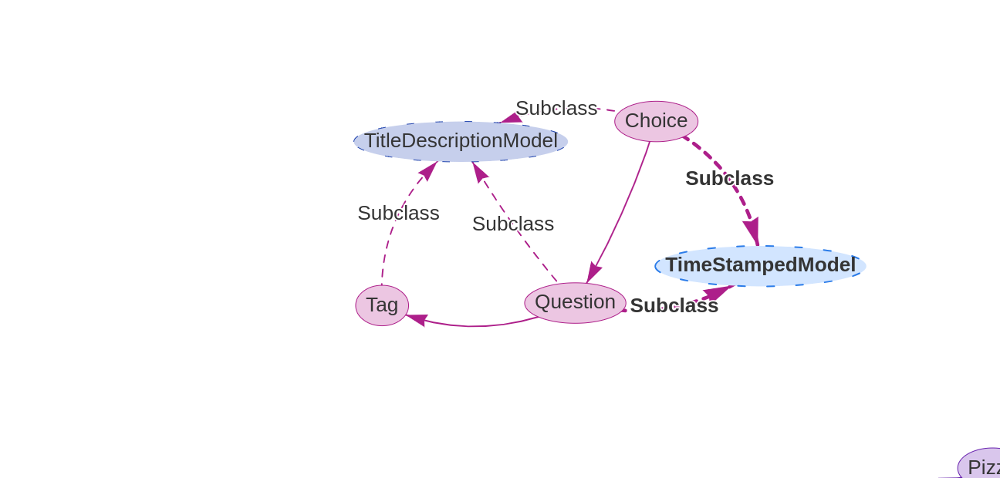
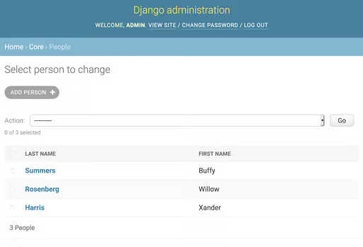
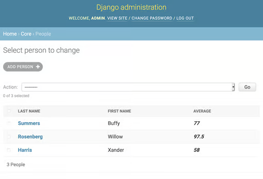
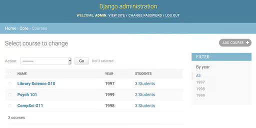
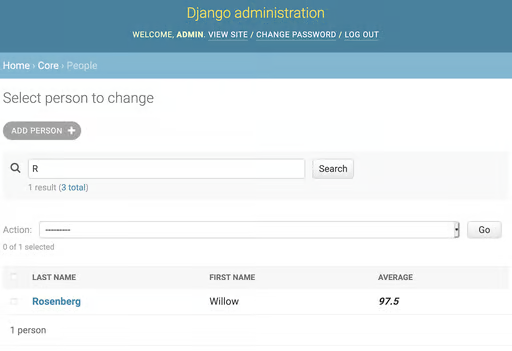
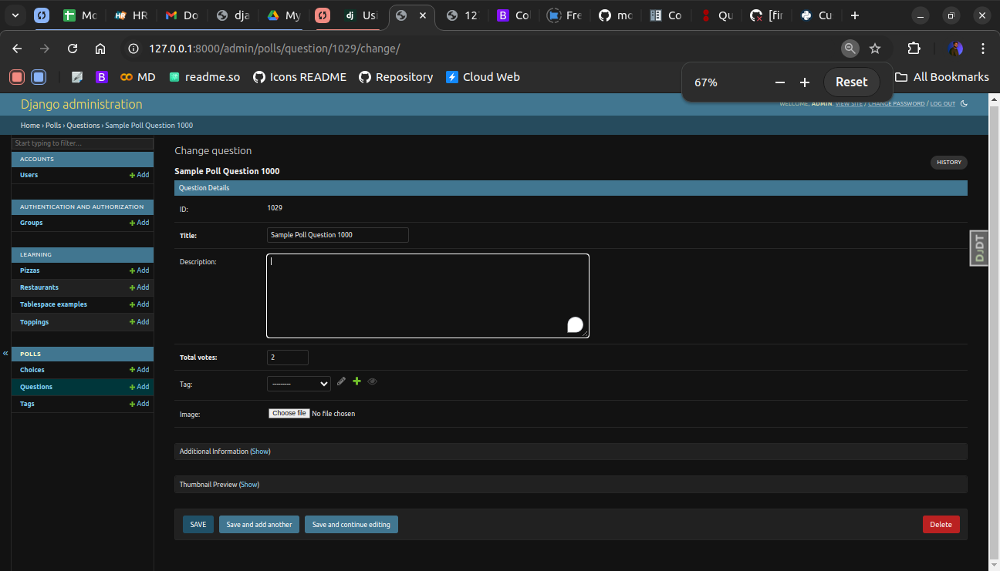
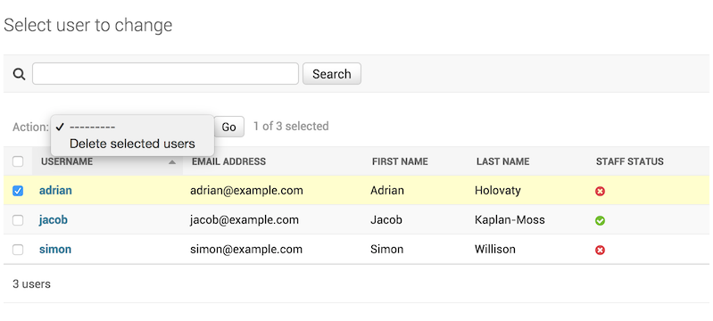
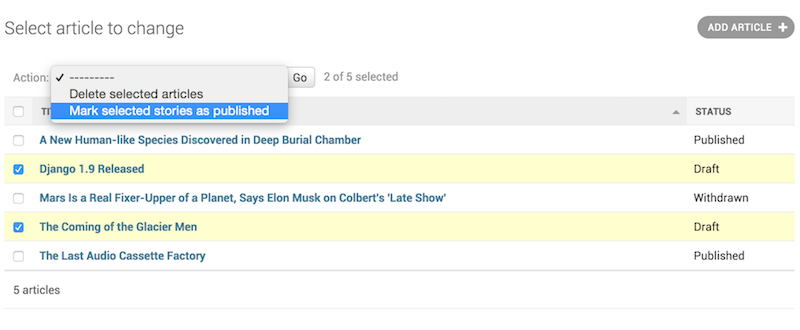

<link href="https://maxcdn.bootstrapcdn.com/bootstrap/3.3.6/css/bootstrap.min.css" rel="stylesheet"/>

# Custom Admin Panel

The Django framework comes with a powerful administrative tool called admin. You can use it out of the box to quickly add, delete, or edit any database model from a web interface. But with a little extra code, you can customize the Django admin to take your admin capabilities to the next level.

Here is Our Model Relation



Now, Lets Update Our Admin Panel,

## list_display

You can customize change list pages in far more ways than just modifying an object’s string representation. The list_display attribute of an admin.ModelAdmin object specifies what columns are shown in the change list.


## Ordering

The two columns are clickable, allowing you to sort the page by the column data. The admin also respects the ordering attribute of a Meta section:

### Admin Panel Functions

```python
@admin.register(Person)
class PersonAdmin(admin.ModelAdmin):
    list_display = ("last_name", "first_name", "show_average")
    show_average.short_description = "Average"

    def show_average(self, obj):
        from django.db.models import Avg
        result = Grade.objects.filter(person=obj).aggregate(Avg("grade"))
        return result["grade__avg"]
```



## List Filter

you can also filter with a built-in widget. Add the list_filter attribute to the CourseAdmin object in core/admin.py:

```python
list_filter = ("year", )
```



## Searching

Filters aren’t the only way to reduce the amount of data on the screen. Django admin also supports searching through the search_fields option, which adds a search box to the screen. You set it with a tuple containing the names of fields to be used for constructing a search query in the database.

```python
search_fields = ("last_name__startswith", )
```



## Fields & Fieldsets

You can customize more than just the change list page. The screens used to add or change an object are based on a ModelForm. Django automatically generates the form based on the model being edited.

```python
@admin.register(Person)
class PersonAdmin(admin.ModelAdmin):
    fields = ("first_name", "last_name", "courses")
```


## Fieldsets

Create Different Sections Based on Fields

```python
fieldsets = [
        (
            "Question Details",
            {
                "fields": [
                    "id",
                    "title",
                    "description",
                    "total_votes",
                    "tag",
                    # "choice_all",
                    "image",
                ],
            },
        ),
        (
            "Additional Information",
            {"classes": ["collapse"], "fields": ["created", "modified"]},
        ),
        (
            "Thumbnail Preview",
            {"classes": ["collapse"], "fields": ["thumbnail_preview"]},
        ),
    ]
```



## Model Options

### 1. date_hierarchy

```python
date_hierarchy = "pub_date"
```

Lookup Hierarchy `__lookup`

```python
date_hierarchy = "author__pub_date"
```

#### 2. Exclude

Similar to fields exclude is used to
exclude a model field from admin panel

```python
class AuthorAdmin(admin.ModelAdmin):
    exclude = ["birth_date"]
```

### 3. fieldset classes

A list or tuple containing extra CSS classes to apply to the fieldset.

```python
{
    "classes": ["wide", "extrapretty"],
}
```

### 4. Admin Actions

If you look at any change list in the admin, you’ll see this feature in action; Django ships with a “delete selected objects” action available to all models.


```python
def make_published(modeladmin, request, queryset):
    queryset.update(status="p")

```

Add Description

```python
from django.contrib import admin

...

@admin.action(description="Mark selected stories as published")
def make_published(modeladmin, request, queryset):
    queryset.update(status="p")
```

Final View

```pythonfrom django.contrib import admin
from myapp.models import Article


@admin.action(description="Mark selected stories as published")
def make_published(modeladmin, request, queryset):
    queryset.update(status="p")


class ArticleAdmin(admin.ModelAdmin):
    list_display = ["title", "status"]
    ordering = ["title"]
    actions = [make_published]


admin.site.register(Article, ArticleAdmin)
```


