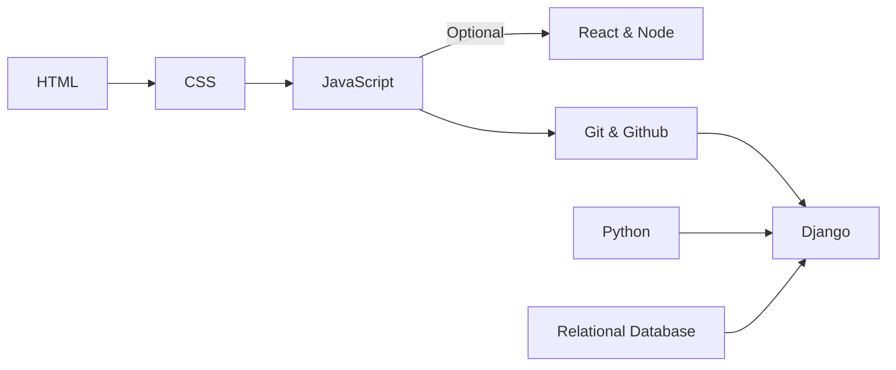

# Welcome to Django-Documentaion

This repository serves as a comprehensive guide to Simplify Webdevelopment Process with Django. <a href="#LearnSmart">#LearnSmart</a>

## Contents

Overview

- [Overview Django](https://github.com/mohit-trootech/Django-Documentation/blob/development/01%20Overview.md)
- [Installation](https://github.com/mohit-trootech/Django-Documentation/blob/development/02%20Installation.md)

Startproject

- [First Django Project](https://github.com/mohit-trootech/Django-Documentation/blob/development/03%20Start%20First%20Django%20Project.md)
- [Admin & Manage.py](https://github.com/mohit-trootech/Django-Documentation/blob/development/04%20django%20admin%20%26%20manage.py.md)
- [settings.py](https://github.com/mohit-trootech/Django-Documentation/blob/development/05%20Setting%20File.md)
- [urls.py](https://github.com/mohit-trootech/Django-Documentation/blob/development/06%20Urls%20File.md)
- [wsgi.py](https://github.com/mohit-trootech/Django-Documentation/blob/development/07%20Wsgi%20File.md)
- [asgi.py](https://github.com/mohit-trootech/Django-Documentation/blob/development/08%20Asgi%20File.md)

Basics of Django

- [Request & Response](https://github.com/mohit-trootech/Django-Documentation/blob/development/09%20Django%20Request%20%26%20Response%20Process.md)
- [Polls Application](https://github.com/mohit-trootech/Django-Documentation/blob/development/10%20Continue%20Polls%20Application.md)
- [Template HTML](https://github.com/mohit-trootech/Django-Documentation/blob/development/11%20Template%20HTML.md)
- [Template Arguments](https://github.com/mohit-trootech/Django-Documentation/blob/development/12%20Template%20Arguments.md)
- [Static Files](https://github.com/mohit-trootech/Django-Documentation/blob/development/13%20Static%20Files.md)
- [Database](https://github.com/mohit-trootech/Django-Documentation/blob/development/14%20Databases.md)
- [First Model](https://github.com/mohit-trootech/Django-Documentation/blob/development/15%20First%20Model.md)
[text](https://github.com/mohit-trootech/Django-Documentation/blob/development/15%20First%20Model.md)
- [Migrations](https://github.com/mohit-trootech/Django-Documentation/blob/development/16%20Migrations.md)
- [Model Relation](https://github.com/mohit-trootech/Django-Documentation/blob/development/17%20Model%20Relation.md)
- [Django Shell](https://github.com/mohit-trootech/Django-Documentation/blob/development/18%20Django%20Shell.md)
- [Admin](https://github.com/mohit-trootech/Django-Documentation/blob/development/19%20Django%20Admin.md)
- [Views](https://github.com/mohit-trootech/Django-Documentation/blob/development/20%20Views.md)
- [Working Views](https://github.com/mohit-trootech/Django-Documentation/blob/development/21%20Working%20Views.md)
- [Jinja Template](https://github.com/mohit-trootech/Django-Documentation/blob/development/22%20Jinja%20Template.md)
- [Templates](https://github.com/mohit-trootech/Django-Documentation/blob/development/23%20Templates%20Inheritance.md)
- [Filter & Tags](https://github.com/mohit-trootech/Django-Documentation/blob/development/24%20Template%20Tag%20%26%20Filter.md)
- [Custom Filter & Tags](https://github.com/mohit-trootech/Django-Documentation/blob/development/25%20Custom%20Tags%20%26%20Filters.md)
- [Raising 404](https://github.com/mohit-trootech/Django-Documentation/blob/development/26%20Raising%20404%20Error.md)
- [Generic Views](https://github.com/mohit-trootech/Django-Documentation/blob/development/27%20Generic%20Views.md)

Overview

- Overview Django
- Installation

## Roadmap

## Prerequisites

Following are the Prerequisites, Before Starting With Django

| Name                          | Description | Reference |
|------                         |-------------|-----------|
| HTML                          | Core Web Development | [link](https://github.com/mohit-trootech/HTML-Documentation) |
| CSS                           | Core Web Development | [link](https://github.com/mohit-trootech/CSS-Documentation)             |
| JavaScript                    | Core Web Development | Available Soon |
| Bootstrap                     | Web Framework Basic | [link](https://github.com/mohit-trootech/Bootstrap-Documentation) |
| Git & Github                  | Version Control System | [link](https://github.com/mohit-trootech/Git-GitHub-Documentation) |
| Python                        | Core Programming Language | Available Soon |

## Contributions

Contributions are welcome! If you have suggestions, corrections, or additional examples to add, please feel free to fork this repository, make your changes, and submit a pull request. Together, we can make this guide even more valuable for learners and developers alike.

## License

This repository is licensed under the MIT License. See the LICENSE file for more information.

<!-- Boostrap Markdown File -->
<link href="https://maxcdn.bootstrapcdn.com/bootstrap/3.3.6/css/bootstrap.min.css" rel="stylesheet" />
